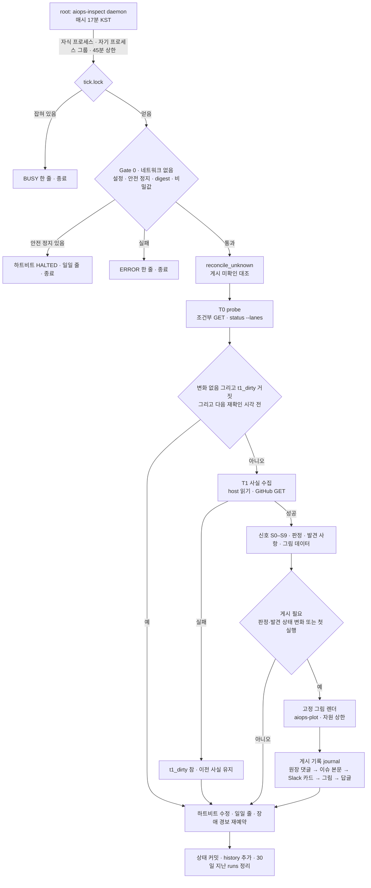

# 프로그램 감리 (User 결정 M7) — 규격과 운영 절차

상태: **1단계(기계 감리) 규격과 설치 절차.** 모델을 쓰지 않는다.
이 문서는 감리의 규범 문서다. 결정 원문은 `PROGRAM_MODE.md` §0 "결정 M7"에 있고, 남는 위험의 요약은
같은 문서 §13 "감리 (M7)"에 있다. 이 문서는 `RUNTIME_PATHS` 밖이다. 그래도 §3~§11과 §14의 규칙을
바꾸는 PR은 감리 코드와 같은 변경 통제(§15)를 받는다.

목표: User가 약 1분 안에 다음을 본다.
- 프로그램 모드의 각 제품이 어디까지 왔는가.
- 어디서 막혔는가.
- 작업이 계획 밖으로 나갔는가.
- 실제로 확인된 것이 얼마인가.

## 0. 결정과 범위

**결정 M7 (User, 2026-09-30).** 세션: https://claude.ai/code/session_01R56yQzeU25A4nsAmRZJw7z
- 독립된 읽기 전용 프로그램 감리를 둔다. 자문만 한다. 게이트가 아니다.
- 그록봇 컴퓨터의 root 고정 도구 `aiops-inspect`가 매시간 한 번 돈다. 그록봇 토큰은 쓰지 않는다(0).
- User 점검 명령은 없다. 감리가 스스로 돌고, 결과를 감리 채널과 원장 이슈에 올린다.
- 사람이 보고 바로 알 수 있도록 그림을 직접 만든다.
- "전부 알아서 해": 남은 선택(단계 조건, 전용 토큰과 Slack 봇, 원장 읽기 계정, 채널 이름)은 아래 권장 기본값을 따른다.

**단계.** 각 단계는 별도 PR이다. 앞 단계가 다음 단계를 켜지 않는다.

| 단계 | 내용 | PR | 모델 | 켜는 조건 |
|---|---|---|---|---|
| 1단계 기계 감리 | 사실 수집, 기계 신호, 발견 사항, 고정 그림 5개, 게시 | PR1 (이 문서) | 없음 | §12 설치, §13 수용 시험 |
| 2단계 모델 자문 | 모델이 사실을 읽고 판단 문장을 더한다. 숫자와 기계 하한은 바꾸지 못한다 | PR2 | 있음 | §14 조건 전부 |
| 3단계 모델 그림 코드 | 모델이 그림 코드를 쓰고, 격리된 계정이 실행한다. 선택 기능 | PR3 | 있음 | §14 조건 전부 + 격리 증명 |

PR2와 PR3은 `RUNTIME_PATHS` 파일을 바꾸지 않는다. 그래서 감리 전체의 운영 규칙은 이 PR에 모두 들어 있다.

**권장 기본값 (M7 "전부 알아서 해").**

| 항목 | 기본값 |
|---|---|
| 운영 Slack 채널 | `#ai-inspection` (비공개) |
| 시험 Slack 채널 | `#ai-inspection-test` (비공개) |
| 운영 원장 이슈 | `BeautifulMind-JT/ai-ops-control-plane`의 "AIOPS Program Health" |
| 시험 원장 이슈 | 같은 저장소의 "AIOPS Program Health (test)" |
| Slack 봇 | 전용 Slack 앱 "AIOPS 감리". 범위는 `chat:write`, `files:write` 두 개뿐 |
| GitHub 토큰 | fine-grained PAT 2개: 읽기용 `aiops-inspect-gh-read`, 원장 기록용 `aiops-inspect-gh-ledger` |
| 원장 읽기 계정 | `aiops-inspect-ledger` (host 읽기 3개만) |
| 그림 계정 | `aiops-plot` |
| 점검 시각 | 매시 17분 KST (`tick_minute: 17`) |
| 일일 줄 | 09시 이후 첫 점검, 보통 09:17 KST (`daily_hour_kst: 9`) |
| 장애 경보(dead-man) | 3시간 (`deadman_hours: 3`) |
| 계약 쌍(S4) | 비움. "미설정"으로 보인다 (`contract_pairs: []`) |
| 시작 단계 | `DRY` (시험 채널과 시험 이슈에만 게시) |
| 토큰 만료 | 두 PAT 모두 같은 날, 180일 |

**감리가 하지 않는 일.**
- 병합, 발송, materialize, reap, 레인 선택을 하지 않는다.
- 작업 이슈를 만들거나 라벨을 붙이지 않는다.
- 작업 이슈와 PR에 댓글을 달지 않는다.
- 어떤 gate에도 들어가지 않는다. 감리 글은 발송·리뷰·병합 판단의 입력이 아니다.
- 어떤 역할에도 지시하지 않는다. 현장 소장과 그록봇은 감리 글을 읽지 않는다.
- Slack을 읽지 않는다. 다른 채널에 쓰지 않는다.
- 완료를 스스로 계산하지 않는다. 중앙 함수 하나만 쓴다(§5).
- 배포와 실사용 검증을 추정하지 않는다. 중앙 기록이 없으므로 "기록 없음"으로 보인다.
- host의 바꾸는 명령(`reap`, `reconcile`, `init`, `migrate`, `materialize-begin`, `materialize-finish`, `materialize-plan`, `materialize-resolve`, `preflight`, `launch`)을 부르지 않는다.
- 1단계에서는 모델과 유료 사용을 쓰지 않는다.
- 자기가 기록한 자식 프로세스가 아닌 프로세스에 신호를 보내지 않는다. `kill -1`을 쓰지 않는다.

## 1. 역할과 권한

| 누구 | 하는 일 | 하지 않는 일 |
|---|---|---|
| INSPECTOR (`aiops-inspect`, root 고정 도구) | 읽기, 신호 계산, 원장 이슈 하나와 감리 채널 하나에 게시 | 위 "하지 않는 일" 전부 (`AGENTS.md` §2 INSPECTOR) |
| User | 설치 지시, 토큰과 Slack 앱 만들기, 단계 전환 지시, 재개 지시, 감리 글 읽기 | — |
| 그록봇 (HOST OPERATOR) | 설치, 호스트 재시작 뒤 `start`, User 지시로 고정 명령 `preflight`, `status`, `start`, `stop`, `resume` 실행 | 점검 실행·예약, 감리 결과 전달·읽기·요약, 설정과 문턱의 임의 변경, 비밀값 출력 (`AGENTS.md` §5) |
| 현장 소장 | 감리와 무관하게 일한다 | 감리 채널, "AIOPS Program Health" 이슈, `AIOPS_INSPECT_V1` 글을 읽거나 그에 따라 행동 (`COORDINATOR_PLAYBOOK.md` §0) |
| Astra (Fable) | 감리 코드 변경의 A3 감사(§15) | 감리 결과를 판정 근거로 쓰기 |

감리가 쓸 수 있는 곳은 정확히 두 곳이다(DRY에서는 각각의 시험용).
1. 설정된 원장 이슈 하나의 댓글과 본문 (`control_repository` 안).
2. 설정된 Slack 채널 하나 (전용 봇).

그록봇이 고정 명령을 실행하면, 명령이 출력한 JSON 한 줄을 그대로 User에게 전한다. 해석하거나 요약하지 않는다.

## 2. 구조

### 2.1 계정

| 계정 | 실행하는 것 | 가진 것 | 조건 |
|---|---|---|---|
| root | `aiops-inspect daemon`, `tick`, 모든 GitHub·Slack 입출력, 검증, 게시 | 감리 비밀값 3개 (실행 중 메모리에만) | — |
| `aiops-inspect-ledger` | `sudo -n -u astra-control /opt/astra/bin/astra-host-control` 읽기 3개 | 없음 | system 계정, `/usr/sbin/nologin`, uid·gid ≠ 0, 보조 그룹 없음, crontab 없음 |
| `aiops-plot` | 고정 그림 렌더 (`control_plane_inspect_charts.py render`) | 없음 | 같은 조건 |
| `astra-control` (기존) | host helper | ledger | 바꾸지 않는다 |

- 두 감리 계정은 레인이 아니다. host policy의 `builder_uids`, `control_uid`, `runner_uid` 어디에도 없다.
- `aiops-auditor`(Fable)와도 다른 계정이다.
- helper의 `authorize_identity`(`control_plane_host.py`)는 빌더·control이 아닌 호출자를 모든 동사에 허용한다. 그래서 감리를 읽기 3개로 묶는 경계는 sudoers 파일(`/etc/sudoers.d/aiops-inspector`)이다. 감리는 helper를 root로 부르지 않는다.

### 2.2 경로

| 경로 | 소유와 모드 | 내용 |
|---|---|---|
| `/opt/aiops/bin/aiops-inspect` | root:root 0755 | `engineering/scripts/control_plane_inspect.py` 그대로 |
| `/opt/aiops/inspect/lib/` | root:root 0755 | 설치된 모듈 폴더 |
| `/opt/aiops/inspect/lib/*.py` | root:root 0444 | 감리 모듈 8개 + `control_plane.py` + `control_plane_program.py` (같은 커밋) |
| `/etc/aiops/inspect.json` | root:root 0600 | 설정 `AIOPS_INSPECT_CONFIG_V1` |
| `/etc/aiops/inspect-gh-read` | root:root 0600 | GitHub 읽기 토큰 |
| `/etc/aiops/inspect-gh-ledger` | root:root 0600 | GitHub 원장 기록 토큰 |
| `/etc/aiops/inspect-slack-token` | root:root 0600 | Slack 봇 토큰 (`xoxb-`) |
| `/etc/aiops/inspect-expected.sha256` | root:root 0644 | 기대 digest 목록 (§12.3) |
| `/etc/aiops/inspect-disabled` | root:root 0644 (있을 때만) | 안전 정지 표시. 사유, run, 시각 |
| `/etc/sudoers.d/aiops-inspector` | root:root 0440 | `sudoers-aiops-inspector.example` 그대로. 이름에 점이 없다 |
| `/var/lib/aiops-inspect/` | root:root 0700 | 감리 데이터 |
| `/var/lib/aiops-inspect/state/` | root:root 0700 | 상태 파일 (아래) |
| `/var/lib/aiops-inspect/runs/` | root:root 0700 | 실행 폴더 `<YYYYMMDDTHHMMSSZ>-<8hex>-<kind>/`. 30일 보관 |
| `/var/lib/aiops-plot/` | root:aiops-plot 0750 | 실행마다 렌더 폴더 |

<!-- CONTRACT NOTE: the contract fixes /var/lib/aiops-plot only as the per-run render root; root:aiops-plot 0750 is the safer reading (the render account may traverse, not create). preflight's owner/mode check is authoritative. -->

감리 모듈 8개: `control_plane_inspect.py`, `control_plane_inspect_core.py`, `control_plane_inspect_github.py`,
`control_plane_inspect_host.py`, `control_plane_inspect_facts.py`, `control_plane_inspect_signals.py`,
`control_plane_inspect_charts.py`, `control_plane_inspect_publish.py`.

주요 상태 파일 (`state/`): `etags.json`(+ `etags.pending.json`), `recheck.json`, `facts.json`, `hashes.json`,
`findings.json`, `baseline.json`, `history.jsonl`, `errors.jsonl`, `heartbeat.json`, `children.json`,
`publish/<run>.json`, `daemon.pid`, `daemon.lock`, `tick.lock`.
상태는 JSON만 쓴다. 파일 하나에 32 MiB 상한이 있다. 쓰기는 임시 파일, fsync, `os.replace` 순서다(0600).

### 2.3 한 번의 점검 흐름



### 2.4 명령

모든 명령은 표준 출력에 JSON **한 줄**만 쓴다(`ensure_ascii=False`).
종료 코드: 0 = 정상 또는 처리됨, 1 = `{"status":"ERROR","reason":<CODE>}`, 2 = 인수 오류.
예외는 모두 잡아서 위생 처리 후 ERROR 줄로 바꾼다. 표준 출력에 traceback이 나오지 않는다.

| 명령 | 하는 일 | 잠금 |
|---|---|---|
| `daemon` | 상주 루프. 직접 부르지 않고 `start`가 띄운다 | `daemon.lock` |
| `start` | 이중 fork, `setsid`, 표준 입출력 `/dev/null`, `daemon.pid` 기록. `{"status":"STARTED","pid":...}`. 이미 돌고 있으면 `ALREADY_RUNNING` | `daemon.lock` |
| `stop` | `daemon.pid`의 프로세스가 Uid 0이고 명령줄에 `aiops-inspect`와 `daemon`이 있을 때만 SIGTERM. 최대 30초 기다림. 하트비트 PAUSED, 장애 경보 예약 취소 | 없음 |
| `status` | 데몬 생존, 마지막 점검, 하트비트 상태, 안전 정지, 수준별 열린 발견 수, 게시 미확인 수, 토큰 만료, digest 확인. 네트워크 없음 | 없음 |
| `tick` | 점검 한 번 (§3) | `tick.lock` |
| `probe` | T0 + T1을 `runs/<id>/probe-state`에서 실행. 데몬 상태를 건드리지 않는다. 개수와 hash만 출력. 쓰기 없음 | `tick.lock` |
| `preflight` | 설치 점검. GitHub·Slack 쓰기 없음. `{"status":"PASS"\|"FAIL","checks":[...]}` | `tick.lock` |
| `resume --pointer URL` | 안전 정지 해제. URL은 `https://github.com/<control_repository>/issues/<n>#issuecomment-<m>` 모양이어야 한다. `history.jsonl`에 `{"resume": url, "at": now}`를 남긴다 | `tick.lock` |
| `set-secret {gh-read,gh-ledger,slack}` | 화면 표시 없이 값을 받는다. 모양을 검사하고 0600으로 원자적으로 쓴다. `{"status":"STORED","kind":...,"sha256_8":...}`만 출력 | 없음 |
| `render` | 내부용. 그림 모듈에 넘긴다 | `tick.lock` |

`--root`는 테스트 전용이다. 설치된 도구는 기본값 `/`로만 실행한다.

## 3. 한 번의 점검

**깨우는 방법.** root 루프 `aiops-inspect daemon` 하나다.
- 다음 `tick_minute`(17분) KST까지 잔다.
- `tick`을 자식 프로세스로 띄운다. 자식은 자기 프로세스 그룹을 가진다. 상한은 45분이다.
- 자식과 렌더 자식의 pgid를 `children.json`에 적는다.
- 45분을 넘기면 기록된 그룹만 `killpg`하고 `DEGRADED reason=OVERRUN`으로 표시한다.
- 점검 실패는 루프를 끝내지 않는다. SIGTERM을 받으면 기록된 그룹을 정리하고 끝난다.
- cron, systemd 단위, Actions workflow는 쓰지 않는다. 감리의 예약 실행은 이 root 루프 하나다.

**순서.**
1. **Gate 0** (네트워크 없음).
   - 설정이 유효하다. 아니면 ERROR.
   - 안전 정지 파일이 있으면 하트비트를 HALTED로 고치고, 일일 줄만 처리하고 끝낸다.
   - 기대 digest가 맞다. 아니면 안전 정지 `TOOL_TAMPERED`.
   - 비밀값 3개를 읽는다(모양과 권한 검사).
2. **`reconcile_unknown()`**: 이전에 결과를 몰랐던 게시를 대조한다(§9.2).
3. **T0 probe**. 조기 종료 규칙이 맞으면 하트비트, 일일 줄, 장애 경보만 처리한다. 바뀐 것이 없으면 ETag를 커밋하고 끝낸다.
4. **T1 사실 수집**. 실패하면 `t1_dirty = true`로 두고 이전 사실을 유지한다. 연속 3번 실패하면 하트비트가 `DEGRADED(GITHUB_READ)` 또는 `DEGRADED(HOST)`가 된다.
5. **신호, 발견 사항 수명 주기, 그림 데이터.**
6. **게시가 필요하면** 렌더(`aiops-plot`)와 게시(journal).
7. **하트비트, 일일 줄(때가 되면), 장애 경보.** 상태를 원자적으로 커밋하고 history를 더하고 30일 지난 실행 폴더를 지운다.

출력: `{"status":"OK","run":...,"t1":"SKIPPED|DONE|FAILED","published":true|false,...}`.

**T0 probe** (매 점검. 상태 `etags.json`의 ETag로 조건부 GET).
- control 저장소: `GET /repos/{ctrl}/branches/main`.
- 대상 저장소마다:
  - `GET /repos/{r}` (기본 branch를 상태에 저장. 하루에 한 번 새로 읽음)
  - `GET /repos/{r}/branches/{default}`
  - `GET /repos/{r}/issues?labels=aiops-task&state=all&sort=updated&direction=desc&per_page=50`
  - `GET /repos/{r}/pulls?state=all&sort=updated&direction=desc&per_page=50`
  - `GET /repos/{r}/issues/comments?since=<마지막으로 커밋한 T1 시각>&per_page=100` (`since`는 커밋 사이에 고정)
- host: `lanes()` (항상. 그 정규 JSON hash가 probe의 일부)
- 새 ETag는 `etags.pending.json`에 둔다. T1이 성공했을 때나 바뀐 것이 없을 때만 커밋한다.
- `changed`: 조건부 GET 하나라도 200이거나 lanes hash가 바뀌면 참.

**조기 종료 규칙 (상태 기반).** 다음 세 가지가 **모두** 맞을 때만 T1을 건너뛴다.
1. probe에 변화가 없다.
2. `recheck.json`의 `t1_dirty`가 거짓이다.
3. 지금이 `next_recheck_at` 전이다.

그 밖에는 T1을 실행한다. 그래서 실패한 T1은 다음 점검에서 반드시 다시 돈다.
`next_recheck_at`은 다음 시각 중 가장 이른 것이다.
- 각 CONFIRMED 행, 각 막힘 라벨, 각 제품의 마지막 완료 뒤 날수, 각 대기 중인 병합 후 체크가 다음 문턱 구간을 넘는 시각
- 다음 KST 일일 줄 시각
- 지금 + 24시간

**T1 내용.**
- control: main의 `projects.json`, `activation.json` (contents API), `control-plane-runtime.yml`의 최근 실행 5개.
- 제품 계획: 기본 branch에서 `.aiops/program.json`을 바꾼 마지막 커밋과 그 SHA의 내용.
  중앙 `validate_plan`의 의미로 검사한다. 틀린 계획은 예외가 아니라 사실 `plan.state = "INVALID"`이다. 계획이 없으면 `NONE`(제품은 PAUSED).
- 대기 중인 계획 PR: 열린 PR 중 `.aiops/program.json`을 바꾸는 것 (최대 20개).
- 노드마다: `materialize_status(program, node)`. CREATED면 `task_status(repo, task_id_for(program, node))`.
  배달 pin은 중앙 `current_writer`, `pin_of`로 찾는다. pin이 있으면 그 PR, 병합됐으면 병합 커밋의 check run과 PR 파일 목록.
  그다음 `node_completion`(§5).
- 노드 이슈 상태. 막힘 라벨(`needs-user`, `needs-operator`, `needs-lane-cleanup`, `blocked`, `decision-required`)이 있으면 이슈 이벤트에서 `blocked_since`.
- 최근 7일 기본 branch 병합 PR, 직접 push(`commits/{sha}/pulls`가 빈 커밋).
- 최근 14일 `ASTRA_CONSULT_V1 result=APPROVED_SMALL_EXCEPTION` 댓글 수 (노드별).
- 필수 체크: `projects.json`의 `program_required_checks`. 처음 본 목록을 `baseline.json`에 두고, 이후 줄어들면 사실 `required_checks_shrank`.
- 감리 자신의 원장 댓글: journal에 있는 댓글 id마다 현재 `updated_at`과 본문 sha256 (S0).

**예산.** 넘으면 그 단계를 `InspectError`로 끊는다. T1이면 `t1_dirty = true`이고 이전 사실을 유지한다.

| 항목 | 상한 |
|---|---|
| 점검 전체 | 45분 (데몬이 `killpg`) |
| T1 | 8분 |
| host 호출 | 점검당 200번, 호출당 10초 |
| GitHub 요청 | T1당 600번 |
| GitHub 응답 크기 | 8 MiB |
| host 출력 크기 | 4 MiB |
| 렌더 | 3분. 렌더 프로세스는 CPU 60초, 주소 공간 1.5 GiB, 파일 20 MiB, 파일 수 64, 프로세스 수 32, 벽시계 120초 뒤 `killpg` |
| 게시 | 3분 |

**상태 커밋.** T1이 성공하면 한 묶음으로 커밋한다: `facts.json`, `hashes.json`,
`recheck.json`(`{"next_recheck_at", "t1_dirty": false, "last_t1": now}`), ETag, `history.jsonl` 한 줄
(`{"t": now, "products": {repo: {"planned": n, "done": n}}}`).

## 4. 사실과 출처 등급

모든 사실 묶음에 출처 등급이 붙는다.

| 등급 | 무엇 | 누가 바꿀 수 있나 | 신호의 최대 수준 |
|---|---|---|---|
| `HOST` | host ledger (`status --lanes`, `task-status`, `materialize-status`) | host helper만 | 위험(AT_RISK) |
| `GH_SYSTEM` | GitHub가 정하는 값: merged, merged_at, merge_commit_sha, head.sha, 파일 status, check run 결과와 app, 시각 | GitHub만 | 위험(AT_RISK) |
| `SHA_CONTENT` | 고정 SHA의 파일 내용 (계획, `projects.json`) | 그 SHA를 만든 커밋 | 위험(AT_RISK) |
| `GH_TEXT` | 라벨, 이슈 닫힘 이유, 댓글, 표식 | 단일 토큰(M4)으로 누구나 위조 가능 | **주의(WATCH)까지만** |

- `GH_TEXT`에서 나온 표시는 그림에서 빗금(`///`)과 "(GitHub 글 기준)"을 붙인다.
- 수집하지 못한 묶음은 제품의 `unknown` 목록에 들어간다(삼값 논리). 없는 사실을 "정상"으로 보지 않는다.
- GitHub에서 온 글은 사실의 문자열 칸에 들어가기 전에 위생 처리한다(§11.2).

사실 문서는 `AIOPS_INSPECT_FACTS_V1`(정규 JSON, 목록은 안정 키로 정렬)이다.
`facts_core`는 바뀌기 쉬운 칸(수집 시각, 통계, ETag, 내용이 같은 객체의 `updated_at`, check run id와 `started_at`,
`ledger`)을 빼고, 나이는 문턱 구간으로 바꾼다. 제품마다 `material_hash = sha256(canon(product_core))`이고,
`snapshot`은 제품 hash 목록과 control, lanes의 hash다.

## 5. 완료 단계

완료는 감리가 계산하지 않는다. 중앙 함수 `control_plane_program.node_completion` 하나만 쓴다.
런타임의 `dependency_done`도 같은 함수를 쓴다. 그래서 감리의 "완료"와 런타임의 DONE은 항상 같다.

| 단계 | 화면 | 조건 (위에서부터 처음 맞는 것) |
|---|---|---|
| `PLANNED` | 계획 | materialization 기록이 없거나 `NOT_FOUND` |
| `MATERIALIZING` | 이슈 생성 중 | 상태가 CREATED가 아니거나, 다른 저장소를 가리킨다 |
| `DONE` | 완료 | 현재 writer의 host DELIVERY pin이 있고, 그 PR이 배달된 head에서 병합됐다 (`delivery_merged`) |
| `DELIVERED` | 배달됨 | DELIVERY pin이 있다 (아직 병합 안 됨) |
| `IN_PROGRESS` | 진행 중 | 현재 writer 행이 있다 |
| `NOT_STARTED` | 시작 전 | 그 밖 |

병합 후 필수 체크 (`merge_checks`, `required_checks_state`):
- `PASS`: 필수 이름마다 가장 최근 실행이 completed + success.
- `FAIL`: 필수 이름의 실행이 completed인데 success가 아니다.
- `PENDING`: 필수 이름의 실행이 없거나 아직 끝나지 않았다(다른 이름이 FAIL이면 FAIL).
- `NOT_CONFIGURED`: 필수 체크가 설정되지 않았다.
- `N/A`: 아직 DONE이 아니다.

**배포와 실사용 검증: 기록 없음.**
- 배포(`deployed`)와 실사용 검증(`verified`)은 중앙 기록이 없다.
- 그래서 `node_completion`은 둘 다 `NOT_RECORDED`를 돌려주고, 감리는 "기록 없음"으로 보인다.
- 감리는 이것을 추정하지 않는다. 다른 출처로 채우지 않는다.
- 완료(DONE)는 "배달 PR이 병합됨"만 뜻한다. 출시나 동작 확인을 뜻하지 않는다.
- 중앙 기록이 생기면 중앙 함수가 바뀌고, 감리는 그 함수를 따른다(§15).

이슈가 "completed"로 닫혔어도 위 DONE 조건이 아니면 완료가 아니다. 감리는 이것을 S1 "완료 불일치"(주의, GitHub 글 기준)로 보인다.

## 6. 신호 S0–S9

각 신호는 `{"level", "basis", "value", "candidates", "unknown"}`을 돌려준다.
입력이 없으면 `UNKNOWN`(확인 불가)이고, 그 신호의 발견 사항은 그대로 얼린다(§7).

| 신호 | 이름 | 식 | 문턱 → 수준 | 근거 |
|---|---|---|---|---|
| S0 | 기록 정합 (CTRL) | 감리 자신의 원장 댓글 본문 sha256이 journal과 다르다 | 다르면 위험 | HOST (host journal이 기준) |
| S1 | 계획 대비 진행 | 계획 밖 = 7일 안 병합 PR 중 pin 아님이고 `.aiops/`만 바꾼 것도 아님 + 직접 push | ≥ 2 위험, ≥ 1 주의 | GH_SYSTEM |
| S1 | 완료 불일치 | 노드 이슈가 `completed`로 닫혔는데 단계가 DONE이 아님 | 주의 | GH_TEXT |
| S2 | 반복 실패 | 재개 수 = writer 행 수 − 1, 현재 head의 REVIEW FAIL pin 수, 한 리뷰 요청의 세션 수, FAILED_PRESTART 수 | 재개 ≥ 3 위험, ≥ 2 주의. 리뷰 FAIL ≥ 3 위험, ≥ 2 주의. 리뷰 세션 ≥ 3 (`MAX_REVIEW_SESSIONS`) 위험. prestart ≥ 2 주의 | HOST |
| S3 | 작은 예외 누적 | 14일 안 `APPROVED_SMALL_EXCEPTION` 수 | 노드 ≥ 3 또는 제품 ≥ 6 → 주의 (최대 주의) | GH_TEXT |
| S4 | 계약 정합 | 쌍의 한쪽 경로가 7일 안 병합 PR에서 바뀌었는데 상대 경로는 7일 안에 안 바뀜 | 주의. `contract_pairs`가 비면 미설정 | GH_SYSTEM |
| S5 | 증거 약화 | pin된 병합 PR이 테스트 파일을 지우거나 다른 이름으로 옮김(`test_path_regex`), `.github/workflows/`를 바꿈 | 주의 | GH_SYSTEM |
| S5 | 병합 후 체크 | DONE 노드의 `merge_checks` | FAIL 위험. PENDING이 병합 뒤 24시간 넘으면 주의 | GH_SYSTEM |
| S5 | 필수 체크 축소 | `required_checks_shrank` | 위험. 필수 체크 미설정은 값 "NOT_CONFIGURED"이고 하한 없음 | SHA_CONTENT |
| S6 | 정체 (주 경로) | R = 완료 아닌 노드. CP = R로 제한한 계획 DAG의 최장 경로(노드 수, 동점은 id 사전순) | materialization이 UNKNOWN 또는 SUBMITTING이거나 writer 행이 UNKNOWN → 위험 | HOST |
| S6 | 주 경로 막힘 | CP 노드의 `blocked_since` | 24시간 이상 주의 (최대 주의) | GH_TEXT |
| S6 | 완료 공백 | 마지막 완료(완료 노드 배달 PR의 최근 `merged_at`, 없으면 `plan.committed_at`) 뒤 날수. R이 비지 않고 materialize된 노드가 1개 이상일 때 | ≥ 7일 위험, ≥ 3일 주의 | GH_SYSTEM |
| S7 | 레인 (CTRL) | CONFIRMED 활성 행의 나이 | 12시간 초과 위험, 6시간 초과 주의 | HOST |
| S7 | 정리 대기 | `needs-lane-cleanup` 라벨의 나이 | 24시간 초과 주의 | GH_TEXT |
| S7 | 노는데 대기 | 노는 레인(켜져 있고 활성 행 없음, `active_total < max_active_sessions`) > 0 이고 대기 노드(의존 노드가 모두 완료, 단계 PLANNED 또는 NOT_STARTED) > 0 | 연속 T1 2번, 1시간 이상 이어지면 주의 | HOST |
| S8 | 결정 연속성 | 1단계에서는 계산하지 않는다 | 항상 미설정, 값 "2단계(모델)에서 구현" | — |
| S9 | CURSOR canary | 모든 CURSOR writer·reviewer 행을 나열(정보). 같은 head에서 CURSOR REVIEW가 PASS 또는 PASS_WITH_NOTES이고 다른 레인 REVIEW가 FAIL. CURSOR FAILED_PRESTART | 앞의 것 주의, prestart ≥ 2 주의. 처음 본 CURSOR 작업은 정보 줄(발견 아님) | HOST |

- DEVIN에 작업이 먼저 몰리는 것은 고정 순서(D1)이므로 신호가 아니다.
- `DIVERGED`는 2단계 모델 판단용으로 남겨 둔다. 1단계는 만들지 않는다.

**문턱 기본값** (`THRESHOLDS`. 설정 `thresholds`는 아래 키만 바꿀 수 있다).

| 키 | 값 | 키 | 값 |
|---|---|---|---|
| `orphan_watch` | 1 | `orphan_at_risk` | 2 |
| `resumes_watch` | 2 | `resumes_at_risk` | 3 |
| `review_fail_watch` | 2 | `review_fail_at_risk` | 3 |
| `prestart_watch` | 2 | `exceptions_node_watch` | 3 |
| `exceptions_product_watch` | 6 | `blocked_watch_h` | 24 |
| `done_gap_watch_d` | 3 | `done_gap_at_risk_d` | 7 |
| `confirmed_watch_h` | 6 | `confirmed_at_risk_h` | 12 |
| `cleanup_watch_h` | 24 | `idle_waiting_snapshots` | 2 |
| `idle_waiting_min_span_h` | 1 | `pending_checks_watch_h` | 24 |

## 7. 판정과 발견 사항

**수준.** `ON_TRACK`(정상) < `WATCH`(주의) < `AT_RISK`(위험).

| 표시 | 뜻 |
|---|---|
| 정상 / 주의 / 위험 | 신호 수준 |
| `PAUSED` 멈춤 | 계획 없음 또는 계획이 유효하지 않음 (`plan.state != PRESENT`) |
| `NOT_CONFIGURED` 미설정 | 그 신호의 설정이 없음 |
| `UNKNOWN` 확인 불가 | 입력을 얻지 못함. 발견 사항을 얼린다 |

- 제품 판정 = 그 제품 신호들의 최대 수준. 미설정과 확인 불가는 빼고 본다.
- CTRL 판정 = max(S0, S7).
- 판정은 자문이다. 어떤 gate도 이 값을 읽지 않는다.

**발견 사항.** `findings.json`에 둔다. host 저장소가 기준이다.
- 후보: `signal`, `product`(저장소 또는 `CTRL`), `subject_key`, `severity`(WATCH 또는 AT_RISK), `basis`, `title_ko`, `detail_ko`, `evidence`.
- `subject_key` 형식: `node:<id>`, `task:<TASK_ID>`, `pr:<repo>#<n>`, `commit:<repo>@<sha7>`, `lane:<LANE>`, `pair:<i>`, `plan:<repo>`, `ledger:<comment id>`.
- 키 = `sha256(signal|product|subject_key)`의 앞 16자.
- ID = `INS-<prefix>-<NNNN>`. prefix별 번호이고 다시 쓰지 않는다. CTRL 발견은 prefix `CTRL`을 쓴다.
- 글은 고정 한국어 틀이다. 채우는 값은 id, 숫자, 레인 이름, 시각뿐이다. GitHub의 제목, 본문, 댓글을 옮기지 않는다.

**수명 주기** (T1을 커밋한 점검마다).

| 상태 | 조건 |
|---|---|
| `NEW` | 처음 나타남 |
| `OPEN` | 계속 있음. 심각도가 내려가면 새 심각도로 OPEN |
| `WORSENED` | 심각도가 올라감 |
| `REOPENED` | RESOLVED였다가 다시 나타남 |
| `RESOLVED` | 그 신호를 평가한(확인 불가 아님) 커밋된 스냅숏 **2번 연속** 후보가 없음 |
| 확인 불가 (`unknown: true`) | 신호나 제품 입력이 UNKNOWN. 상태를 바꾸지 않고 얼린다 |

ACK는 1단계에 없다. 발견 사항은 `ack: null`이다. 표시용 ACK는 2단계에서 온다.

## 8. 그림

1단계 그림은 host 코드의 고정 틀이다. 모델이 쓴 코드는 없다.
`aiops-plot` 계정이 `python3 -I control_plane_inspect_charts.py render --data <file> --out <dir>`로 그린다(자원 상한은 §3).

| 그림 | 파일 | 보여 주는 것 |
|---|---|---|
| C5 성적표 | `c5_scorecard.png` | 행 = 제품, 열 = S0–S9. 칸마다 수준 낱말과 수준 색. 게시된 판정 열은 굵게 |
| C1 단계 사다리 | `c1_ladder.png` | 제품별 가로 누적 막대: 계획 → 이슈 생성 중 → 시작 전 → 진행 중 → 배달됨 → 완료. 완료는 병합 후 체크 PASS/FAIL/PENDING으로 나눈다. 따로 "계획 밖 병합" 수. 제품마다 고정 글 "배포·실사용 검증: 기록 없음" |
| C2 계획 DAG | `c2_dag_<prefix>.png` | (깊이, 행) 위치의 노드, 단계 색과 단계 낱말. 주 경로 간선은 굵게. 막힌 노드는 빗금과 시간. 완료 아닌 노드가 가장 많은 제품 2개까지 |
| C3 번업 | `c3_burnup.png` | 제품별 완료 수와 계획 수의 계단선 (`history.jsonl` 최근 30일) |
| C4 레인 | `c4_lanes.png` | 고정 순서 4행(DEVIN, GROK_BUILD, GLM, CURSOR). 구간 막대에 작업 id. 노는데 대기 구간은 빗금. 설명 "DEVIN에 먼저 몰리는 것은 정상(고정 순서)" |

표시 규칙.
- 색만으로 뜻을 전하지 않는다. 수준 칸에는 항상 낱말(정상, 주의, 위험, 멈춤, 미설정, 확인 불가)이 있다. 레인은 항상 이름표를 단다.
- 수준 색: 정상 `#0ca30c`, 주의 `#fab219`, 위험 `#d03b3b`, 멈춤·미설정·확인 불가 회색 `#c3c2b7`.
- 레인 색: DEVIN `#2a78d6`, GROK_BUILD `#eb6834`, GLM `#1baf7a`, CURSOR `#4a3aa7`.
- 바탕 `#fcfcfb`, 글자 `#0b0b0b`·`#52514e`·`#898781`, 격자 `#e1e0d9`.
- `GH_TEXT`에서 나온 표시는 빗금 `///`과 "(GitHub 글 기준)"을 붙인다.
- 이중 축 없음. 개수 축은 정수, y축은 0부터.
- 모든 그림의 바닥 글: `사실=기계 집계 · 자문 전용 · 게이트 아님 · snapshot <12hex>`.
- 결정적 출력: 고정 크기, dpi 150, 날짜 메타데이터 없음. PNG의 tEXt, iTXt, zTXt, tIME 조각을 지운다. 크기 2400×1800, 2 MiB 이하.
- 한국어 글꼴("Noto Sans CJK KR", "Noto Sans KR", "NanumGothic")이 없으면 `FONT_MISSING`이고 그림 없이 글 카드만 올린다.
- matplotlib이 없어도 감리는 돈다. 그림만 빠진다.
- DAG 배치(깊이 = 뿌리에서의 최장 경로 깊이, 행 = 깊이 안의 id 순서)는 신호 모듈이 계산한다. 그림에는 그래프 라이브러리가 필요 없다.

## 9. 게시와 기록

### 9.1 순서

게시가 필요한 때: 판정이나 발견 상태가 바뀌었을 때, 또는 첫 실행.

1. journal `state/publish/<run>.json`에 `PREPARED`와 본문 sha256을 먼저 적는다.
2. 원장 이슈에 댓글 하나 → `GH_POSTED`(댓글 id, url) 또는 `GH_UNKNOWN`.
3. 열린 발견 표가 바뀌었으면 이슈 본문 수정 → `GH_BODY_UPDATED` 또는 `GH_BODY_UNKNOWN`.
4. Slack 카드 → `SLACK_POSTED`(ts, 파일 id) 또는 `SLACK_UNKNOWN`. Slack은 GitHub가 POSTED나 UNKNOWN이 된 뒤에만 올린다. 카드의 GitHub 링크는 POSTED일 때만 단다.
5. 카드 스레드에 그림 (`files.getUploadURLExternal` → 바이트 POST → `files.completeUploadExternal`).
6. 스레드 답글 최대 10개: NEW, WORSENED, REOPENED 발견 하나에 하나. 근거 링크는 Slack에서만 누를 수 있다(Slack은 GitHub 이벤트를 만들지 않는다).

### 9.2 결과를 모를 때 (UNKNOWN)

저장소 원칙(`PROGRAM_MODE.md` §8.2, `ASTRA_SLACK.md`)을 따른다.

| 결과 | 기록 | 다음 |
|---|---|---|
| 2xx / `ok` | POSTED | — |
| 4xx, `ok:false`, 연결을 열지 못함 | REFUSED (아무것도 보내지 않음) | 다음 점검부터 최대 3번 다시 시도 |
| 시간 초과, 보낸 뒤 연결 끊김, 5xx | UNKNOWN | **같은 내용을 다시 보내지 않는다** |

- GitHub UNKNOWN: 다음 점검들의 `reconcile_unknown()`이 실행 시작 이후의 원장 댓글을 읽는다. 본문 sha256이 journal과 같은 댓글이 보이면 `GH_POSTED`로 바꾼다.
- 24시간 지나도 보이지 않으면 `GH_ABANDONED_UNKNOWN`. 표시만 하고 다시 보내지 않는다.
- Slack UNKNOWN: 감리는 Slack을 읽지 않으므로 확인할 수 없다. 하트비트에 "게시 미확인 <m>"으로 보인다.

### 9.3 원장 댓글

첫 두 줄은 정확히 다음과 같다.

```
<!-- aiops-inspect -->
AIOPS_INSPECT_V1 run=<id> snapshot=<64hex> stage=<DRY|LIVE> advisory=true gate=none model=none tool=<12hex> verdicts=<PFX:LEVEL,...>
```

그다음 host가 쓴 제목들 아래에:
- 제품 표: 판정, 변화, 사다리 수, 배포·실사용 검증 "기록 없음", 계획 밖 병합, 대기 중인 계획 PR.
- 발견 사항: NEW, WORSENED, RESOLVED, REOPENED를 먼저, 그다음 OPEN. 각각 ID, 수준 낱말, 신호 이름, 대상, 고정 틀 설명, 근거(코드 스팬 참조).
- 레인 요약.
- `<details>` 꼬리: 도구 sha256, 사실 sha256, 그림 PNG sha256, 수집 통계, 확인 불가 묶음.

이슈 본문(열린 발견 표가 바뀔 때만 수정): 단계, 마지막 점검, 열린 발견 표.
댓글은 60,000자 이하로 맞춘다. 넘으면 OPEN 상세부터 뺀다.

### 9.4 Slack

봇 토큰으로 다음 메서드만 쓴다. 테스트가 모듈 소스를 읽어 확인한다.
`auth.test`, `chat.postMessage`, `chat.update`, `chat.scheduleMessage`, `chat.deleteScheduledMessage`,
`files.getUploadURLExternal`, `files.completeUploadExternal`, 그리고 돌려받은 업로드 URL(POST만).

- 쓰기 묶음 전에 `auth.test`가 ok이고, 설정의 `team_id`와 `bot_user_id`가 맞고, 응답 머리글 `x-oauth-scopes`가 정확히 {`chat:write`, `files:write`}여야 한다. 아니면 `SLACK_SCOPE`로 안전 정지.
- 채널: DRY는 `test_channel_id`, LIVE는 `channel_id`.

**하트비트.** 채널마다 메시지 하나. 한 번 만들고 매 점검 `chat.update`로 고친다(ts는 `state/heartbeat.json`).
`message_not_found`면 새로 올린다.

```
AIOPS_INSPECT_V1 heartbeat · 마지막 점검 <KST> · 상태 <OK|DEGRADED(<reason>)|HALTED(<reason>)|PAUSED> · 다음 점검 <KST> · 열린 발견 <n> (위험 <k>) · 게시 미확인 <m> · 토큰 만료 <D-days, 14일 이하일 때>
```

**카드.** 판정이나 발견 상태가 바뀌었을 때, 또는 첫 실행에만.
- 제품마다 한 줄: `<이름>: <낱말> <CODE> <↑/↓/=> (전: <낱말>) · 새 발견 <IDs>`.
- 사다리 요약, 레인 요약, 고정 host 문구, GitHub 링크(POSTED일 때).

**일일 줄.** KST 하루의 `daily_hour_kst` 시각 이후 첫 점검에서 한 번.

```
AIOPS_INSPECT_V1 daily · <KST 날짜> · 점검 <성공 수>/<전체 수> · 카드 <n> · 열린 발견 <n> · 게시 미확인 <m>
```

**장애 경보 (dead-man).**
- Gate 0를 통과한 점검은 (그 뒤에 무슨 일이 있든) `chat.scheduleMessage(post_at=now+deadman_hours)`로 새 예약을 걸고, 그 id를 저장한 **뒤에** 이전 예약을 지운다.
- 지우기에 실패한 id는 `pending_delete`에 두고 매 점검 다시 지운다.
- 예약 글 (User에게):

```
AIOPS_INSPECT_V1 status=STALE · 감리가 <deadman_hours>시간 넘게 점검하지 못했습니다 · 마지막 점검 <KST> · 그록봇에게 "aiops-inspect status" 실행을 지시하세요
```

- 루프나 호스트가 죽으면 Slack이 이 글을 대신 올린다.
- 예약 시각이 지나 글이 올라간 뒤 다시 돌면, 다음 점검이 `AIOPS_INSPECT_V1 status=RECOVERED · 공백 <h>시간` 한 줄을 올린다.
- `stop`은 예약을 취소하고 하트비트를 PAUSED로 고친다.
- 안전 정지 중에는 Gate 0를 통과하지 못하므로 예약이 다시 걸리지 않는다. 그래서 정지 뒤 STALE 글이 올라올 수 있다. 이때는 하트비트의 HALTED 사유를 먼저 본다.

**고정 host 문구.** 모든 카드와 원장 댓글에 들어간다.

```
감리는 로그인·코드·명령을 요청하지 않는다 · 자문 전용 · 게이트 아님
```

시각은 항상 절대 시각(`10/01 14:17 KST`)으로 쓴다. "3분 전" 같은 상대 시각을 쓰지 않는다.

## 10. 실패와 안전 정지

| 상황 | 결과 | 게시 | 복구 |
|---|---|---|---|
| 설정이 틀림 (`CONFIG`) | ERROR, 점검 없음 | 없음 | 그록봇이 User 지시대로 설정을 고치고 `preflight` |
| 비밀값 파일의 권한·모양이 틀림 (`SECRET_<KIND>`) | ERROR | 없음 | `set-secret` 다시 |
| 기대 digest 불일치 (`TOOL_TAMPERED`) | 안전 정지 | 하트비트 HALTED | §12 갱신 절차로 다시 설치, User 지시로 `resume` |
| 나가는 글에 실제 비밀값 (`SECRET_LIVE`) | 안전 정지, 그 글은 올리지 않음 | 하트비트 HALTED | 토큰 교체, User 지시로 `resume` |
| Slack 범위·팀·봇 불일치 (`SLACK_SCOPE`) | 안전 정지 | 원장 댓글만 | Slack 앱 범위를 두 개로 되돌림, `resume` |
| 24시간 안 ERROR 3번 (`errors.jsonl`) | 안전 정지 | 하트비트 HALTED | 원인 확인, `resume` |
| GitHub 읽기 실패 (`GITHUB_RATE_LIMIT`, `GITHUB_5XX`, `GITHUB_READ`, `GITHUB_JSON`, `MAX_RESPONSE`, `NET_DOWN`) | T1 실패, `t1_dirty`, 이전 사실 유지 | 연속 3번이면 `DEGRADED(GITHUB_READ)` | 다음 점검에서 자동 |
| host 읽기 실패 (`HOST_REFUSED`, `HOST_TIMEOUT`, `HOST_BUDGET`, `HOST_ARGV`) | 같음 | 연속 3번이면 `DEGRADED(HOST)` | 자동. 계속되면 sudoers와 helper 확인 |
| T1 예산 초과 | 같음 | 같음 | 자동 |
| 한국어 글꼴 없음 (`FONT_MISSING`), 렌더 실패·시간 초과 | 그림 없음 | 글 카드만 | 글꼴 설치 (§12.10) |
| GitHub 쓰기 거절 (`GITHUB_WRITE_REFUSED`) | REFUSED | — | 다음 점검부터 최대 3번 |
| GitHub 쓰기 결과 불명 (`GITHUB_WRITE_UNKNOWN`) | `GH_UNKNOWN` | 다시 보내지 않음 | 대조로 POSTED, 24시간 뒤 `GH_ABANDONED_UNKNOWN` |
| Slack 거절 / 결과 불명 | REFUSED / UNKNOWN | 거절은 최대 3번, 불명은 다시 보내지 않음 | 하트비트 "게시 미확인" |
| 점검 45분 초과 | 기록된 그룹 `killpg` | `DEGRADED(OVERRUN)` | 자동 |
| `tick.lock`이 잡혀 있음 | BUSY | 없음 | — |
| 데몬이 죽음, 호스트 재시작 | 점검 없음 | Slack이 STALE 경보를 올림 | 그록봇 `status`, `start` (§12.11) |
| 누가 감리 댓글을 고침 | S0 위험 발견 (CTRL) | 카드 | 없음 (기록으로 남김) |
| 토큰 만료 14일 이하 | 하트비트에 D-n | — | 새 토큰, `set-secret` |

**안전 정지 (kill switch).**
- 쓰는 주체: 도구 자신(`TOOL_TAMPERED`, `SECRET_LIVE`, 24시간 안 ERROR 3번, `SLACK_SCOPE`).
- 파일: `/etc/aiops/inspect-disabled` (root 0644, JSON: `reason`, `run`, `at`). 첫 사유가 남는다.
- 정지 중에도 하트비트는 계속 "HALTED since <KST>, 사유"로 고친다.
- 해제는 `resume --pointer URL`로만 한다. URL은 User가 control 저장소 이슈에 남긴 재개 지시 댓글이다.
  그록봇은 그 지시가 있을 때만 실행한다. 파일을 손으로 지우지 않는다.

## 11. 보안

### 11.1 자격 증명

| 비밀값 | 위치 | 읽는 주체 | 절대 넘기지 않는 곳 |
|---|---|---|---|
| GitHub 읽기 토큰 (`github_pat_`, fine-grained) | `/etc/aiops/inspect-gh-read` root 0600 | root 도구, 메모리, HTTP 머리글에만 | argv, 자식 환경, `aiops-plot`, `aiops-inspect-ledger`, 로그, 게시글 |
| GitHub 원장 기록 토큰 (`github_pat_`, fine-grained) | `/etc/aiops/inspect-gh-ledger` root 0600 | 같음 | 같음 |
| Slack 봇 토큰 (`xoxb-`) | `/etc/aiops/inspect-slack-token` root 0600 | 같음 | 같음 |

- 비밀값 파일은 일반 파일(링크 아님), 소유자 uid 0, 모드 정확히 0600이어야 한다.
- 고전 GitHub 토큰(`ghp_` 등)은 거절한다. `github_pat_`만 받는다.
- 이 세 개는 단일 토큰 결정의 감리 한정 예외다(`AGENTS.md` §11, M7). 발송·병합에 쓰지 않는다. 감리에는 발송·병합 자격 증명이 없다.
- host 읽기와 렌더 자식의 환경은 `PATH=/usr/bin:/bin`, `LANG=C.UTF-8`뿐이다.
- 도구는 비밀값을 출력, 기록, 게시, 저장하지 않는다. `set-secret`은 sha256 앞 8자만 출력한다.

### 11.2 위생

- 토큰 모양(`TOKEN_SHAPES`): `sk-ant-…`, `gh[opsru]_…`, `github_pat_…`, `sk-…`, `sess-…`, JWT, `xox[abposr]-…`, `xapp-…`, 개인 키 머리.
- `redact`: 모양이 맞는 문자열과, 실제 비밀값의 20자 이상 부분 문자열을 `[redacted sha256=<8hex>]`로 바꾼다.
  - GitHub에서 온 모든 입력은 사실의 문자열 칸에 들어가기 전에 처리한다.
  - 나가는 모든 글은 올리기 전에 처리한다.
  - 나가는 글에서 **실제 값**이 맞으면 `SECRET_LIVE`로 안전 정지한다. 모양만 맞으면 지우고 센다(입력에서 온 것이다).
- GitHub 글(`gh_text`): Markdown 특수 문자를 이스케이프하고, 줄바꿈과 탭을 공백으로 바꾸고, `@` 뒤에 U+200B를 넣고, 길이를 자른다.
- Slack 글(`slack_text`): `&`, `<`, `>`를 엔터티로 바꾸고, `@` 뒤에 U+200B를 넣는다. 그래서 `<!channel>`, `<@U…>`, `<url|text>`가 만들어지지 않는다.
- 표식 무력화(`strip_markers`): 줄 첫머리의 `ASTRA_`, `AIOPS_`, `<!--` 앞에 U+200B를 넣는다. 감리가 옮긴 글이 다른 도구의 표식으로 읽히지 않는다.

### 11.3 교차 참조 방지

- GitHub 글의 참조는 코드 스팬(`` `BeautifulMind-JT/ZARI#12` ``)으로 쓴다(`gh_ref`). GitHub가 작업 이슈와 PR에 "mentioned" 이벤트를 만들지 않는다.
- `@` 멘션은 모두 무력화한다. 감리 글은 아무도 부르지 않는다.
- 누를 수 있는 근거 링크는 Slack에만 있다.

### 11.4 쓰기 표면

- `GitHubReader`의 경로는 `/repos/<설정된 저장소>/`로 시작해야 한다. 아니면 `PATH_NOT_ALLOWED`.
- `GitHubLedgerWriter`는 설정된 저장소의 설정된 이슈 하나에만 쓴다: 댓글 POST, 본문 PATCH(`{"body": ...}`만). 다른 경로나 이슈 번호를 받는 메서드가 없다.
- host 읽기는 sudoers의 정규식과 같은 정규식으로 인수를 만든다. 그 밖의 인수는 `HOST_ARGV`.
- 프로세스 신호는 자기가 기록한 자식 프로세스 그룹에만 보낸다. `stop`은 `/proc/<pid>/status`의 Uid 0과 명령줄을 확인한 뒤에만 보낸다.

## 12. 설치 절차

그록봇이 User 지시로 실행한다. 각 명령의 출력은 User에게 그대로 전한다.
아래 `$C`는 **User가 병합한 커밋**(40자)이다. 같은 커밋의 파일과 digest만 설치한다.

### 12.0 전제

- PR1이 Fable A3 감사를 받고 User가 병합했다. sudoers 예시가 `RUNTIME_PATHS`에 들어 있으므로 활성화 재결합(활성화 전용 PR)도 끝났다.
- host helper `/opt/astra/bin/astra-host-control`와 계정 `astra-control`이 이미 설치돼 있다.
- `python3` 3.9 이상, `sudo` 1.9.10 이상(sudoers 정규식).
- 바깥 연결: `api.github.com`, `slack.com`, `files.slack.com`.

```sh
C=<User가 병합한 커밋 40자>
SRC=<ai-ops-control-plane 클론 경로>
git -C "$SRC" fetch origin main
git -C "$SRC" merge-base --is-ancestor "$C" origin/main && echo ON_MAIN    # ON_MAIN이 나와야 한다
python3 --version
sudo -V | head -1
```

### 12.1 계정 2개

```sh
sudo useradd --system --user-group --no-create-home --home-dir /nonexistent --shell /usr/sbin/nologin aiops-inspect-ledger
sudo useradd --system --user-group --no-create-home --home-dir /nonexistent --shell /usr/sbin/nologin aiops-plot
id aiops-inspect-ledger            # groups= 자기 그룹 하나뿐
id aiops-plot                      # groups= 자기 그룹 하나뿐
getent passwd aiops-inspect-ledger aiops-plot    # 셸 /usr/sbin/nologin, uid ≠ 0
sudo crontab -l -u aiops-inspect-ledger          # "no crontab"
sudo crontab -l -u aiops-plot                    # "no crontab"
```

- 두 uid가 `/etc/astra/control-plane-host.json`의 `builder_uids`, `control_uid`, `runner_uid` 어디에도 없음을 확인한다.
- 두 계정에 비밀번호, ssh 키, 보조 그룹을 주지 않는다.

### 12.2 파일과 권한

```sh
T=$(mktemp -d)
FILES="control_plane_inspect.py control_plane_inspect_core.py control_plane_inspect_github.py \
control_plane_inspect_host.py control_plane_inspect_facts.py control_plane_inspect_signals.py \
control_plane_inspect_charts.py control_plane_inspect_publish.py control_plane.py control_plane_program.py"
for f in $FILES; do git -C "$SRC" show "$C:engineering/scripts/$f" > "$T/$f"; done
git -C "$SRC" show "$C:engineering/.github/control-plane/sudoers-aiops-inspector.example" > "$T/aiops-inspector"
git -C "$SRC" show "$C:engineering/.github/control-plane/inspector.example.json" > "$T/inspect.json"

sudo install -d -o root -g root -m 0755 /opt/aiops /opt/aiops/bin /opt/aiops/inspect /opt/aiops/inspect/lib /etc/aiops
for f in $FILES; do sudo install -o root -g root -m 0444 "$T/$f" "/opt/aiops/inspect/lib/$f"; done
sudo install -o root -g root -m 0755 "$T/control_plane_inspect.py" /opt/aiops/bin/aiops-inspect
sudo install -d -o root -g root -m 0700 /var/lib/aiops-inspect /var/lib/aiops-inspect/state /var/lib/aiops-inspect/runs
sudo install -d -o root -g aiops-plot -m 0750 /var/lib/aiops-plot
```

`/opt/aiops/bin/aiops-inspect`는 `control_plane_inspect.py`와 같은 파일이다. 도구는 `/opt/aiops/inspect/lib`의 모듈을 불러온다.

### 12.3 기대 digest

기대 digest는 설치한 파일이 아니라 **커밋에서** 만든다: `git show <commit>:<path> | sha256sum`.
형식은 한 줄에 `<64hex>␣␣<절대 경로>`이고, `sha256sum -c`가 그대로 읽는다.

```sh
{
  for f in $FILES; do
    printf '%s  /opt/aiops/inspect/lib/%s\n' "$(git -C "$SRC" show "$C:engineering/scripts/$f" | sha256sum | cut -d' ' -f1)" "$f"
  done
  printf '%s  /opt/aiops/bin/aiops-inspect\n' "$(git -C "$SRC" show "$C:engineering/scripts/control_plane_inspect.py" | sha256sum | cut -d' ' -f1)"
} > "$T/inspect-expected.sha256"
sudo install -o root -g root -m 0644 "$T/inspect-expected.sha256" /etc/aiops/inspect-expected.sha256
sudo sha256sum -c /etc/aiops/inspect-expected.sha256      # 11줄 모두 OK
cat /etc/aiops/inspect-expected.sha256                    # User에게 그대로 전한다
```

이 목록에 없는 파일이 `own_files`에 있거나, 목록의 파일이 없거나 다르면 도구는 `TOOL_TAMPERED`로 멈춘다.

### 12.4 sudoers

```sh
sudo visudo -cf "$T/aiops-inspector"
sudo install -o root -g root -m 0440 "$T/aiops-inspector" /etc/sudoers.d/aiops-inspector
sudo visudo -cf /etc/sudoers.d/aiops-inspector
sudo visudo -c
sudo diff "$T/aiops-inspector" /etc/sudoers.d/aiops-inspector         # 차이 없음
sudo -l -U aiops-inspect-ledger
```

- `sudo -l -U aiops-inspect-ledger`는 `(astra-control) NOPASSWD:` 아래 명령 3개(`status --lanes`, `task-status`, `materialize-status`)만 보여야 한다.
- 허용 확인 (실행하지 않고 판정만 본다):

```sh
sudo -l -U aiops-inspect-ledger -u astra-control /opt/astra/bin/astra-host-control status --lanes      # 경로 출력, 종료 코드 0
sudo -l -U aiops-inspect-ledger -u astra-control /opt/astra/bin/astra-host-control reconcile          # 출력 없음, 종료 코드 1
sudo -l -U aiops-inspect-ledger -u astra-control /opt/astra/bin/astra-host-control init               # 종료 코드 1
sudo -l -U aiops-inspect-ledger -u astra-control /opt/astra/bin/astra-host-control preflight --builder-id CURSOR   # 종료 코드 1
```

- 파일 이름에 점이 있으면 sudo가 읽지 않는다. 이름은 정확히 `aiops-inspector`다.
- 예시 파일은 그대로 쓴다. 바꿀 칸이 없다.

### 12.5 Slack 앱과 비공개 채널

User가 만든다. 그록봇은 토큰을 보지 않는다(§12.8).

1. api.slack.com/apps → "Create New App" → "From an app manifest" → 워크스페이스 선택 → 아래 manifest.

```yaml
display_information:
  name: AIOPS 감리
features:
  bot_user:
    display_name: aiops-inspect
    always_online: false
oauth_config:
  scopes:
    bot:
      - chat:write
      - files:write
settings:
  org_deploy_enabled: false
  socket_mode_enabled: false
  token_rotation_enabled: false
```

2. 범위는 bot `chat:write`, `files:write` **두 개뿐**이다. user 범위, 이벤트 구독, interactivity, slash command는 없다.
   범위를 더하면 도구가 `SLACK_SCOPE`로 멈춘다.
3. "Install to Workspace" → Bot User OAuth Token(`xoxb-`)이 생긴다. 토큰 교체(rotation)는 끈다.
4. 비공개 채널 두 개를 만든다: `#ai-inspection`, `#ai-inspection-test`. 구성원은 User와 봇뿐이다.
   각 채널에서 `/invite @AIOPS 감리`.
5. 이 채널은 `#ai-control`, `#ai-decisions`, `#ai-audit`가 아니다. flow policy의 `request_channel_ids`에 넣지 않는다. ChatGPT Slack 앱을 넣지 않는다.
6. 설정에 넣을 id (토큰을 쓰지 않고 화면에서 읽는다):
   - `team_id`: 웹 Slack 주소 `app.slack.com/client/T…/…`의 `T…`.
   - `bot_user_id`: 봇 프로필 → "멤버 ID 복사" (`U…`).
   - `channel_id`, `test_channel_id`: 채널 이름 → 채널 세부 정보 맨 아래의 채널 ID (`C…`).

### 12.6 원장 이슈 2개

`BeautifulMind-JT/ai-ops-control-plane`에 이슈 두 개를 만든다. User가 웹에서 만들거나, User 지시로 그록봇이 만든다.

```sh
gh issue create --repo BeautifulMind-JT/ai-ops-control-plane --title "AIOPS Program Health" \
  --body "감리 원장 (User 결정 M7). aiops-inspect가 본문과 댓글을 씁니다. 자문 전용 · 게이트 아님."
gh issue create --repo BeautifulMind-JT/ai-ops-control-plane --title "AIOPS Program Health (test)" \
  --body "감리 시험 원장 (DRY). 자문 전용 · 게이트 아님."
```

- 라벨, 담당자, 마일스톤을 붙이지 않는다. 특히 `aiops-task`를 붙이지 않는다.
- 두 번호를 설정의 `ledger_issue`, `test_ledger_issue`에 넣는다.
- 본문은 첫 게시부터 도구가 덮어쓴다.

### 12.7 fine-grained PAT 2개

User가 GitHub → Settings → Developer settings → Personal access tokens → Fine-grained tokens에서 만든다.
두 토큰 모두 Resource owner는 `BeautifulMind-JT`, 만료는 같은 날(180일)이다. Account permissions는 하나도 주지 않는다.

| 항목 | 읽기 토큰 `aiops-inspect-gh-read` | 원장 토큰 `aiops-inspect-gh-ledger` |
|---|---|---|
| Repository access | Only select repositories: `ai-ops-control-plane`, `kix-protocol`, `kix-commerce-apps`, `ZARI`, `film-unit-mv-studio`, `maeum-gyeol` (6개) | Only select repositories: `ai-ops-control-plane` (1개) |
| Metadata | Read-only (필수, 자동) | Read-only (필수, 자동) |
| Contents | Read-only | 없음 |
| Issues | Read-only | **Read and write** |
| Pull requests | Read-only | 없음 |
| Actions | Read-only | 없음 |
| Checks | Read-only | 없음 |
| 그 밖의 모든 권한 | 없음 | 없음 |

- 토큰이 둘인 이유: fine-grained 권한은 고른 저장소 전체에 걸린다. 한 토큰에 Issues 쓰기를 주면 제품 저장소의 작업 이슈에도 쓸 수 있다.
- 원장 토큰은 이 저장소의 모든 이슈에 쓸 수 있다. 원장 이슈 하나로 묶는 것은 도구의 코드다(§11.4, §16).
- 토큰 화면에 Checks 항목이 없으면 고르지 않는다. 그때 check run 읽기가 되는지는 `preflight`와 `probe`가 확인하고, 안 되면 S5 병합 후 체크가 확인 불가로 보인다.
- 게시글은 `BeautifulMind-JT` 이름으로 보인다(M4 단일 로그인). 진짜 감리 글은 머리 줄, Slack 카드의 링크, host journal로 구별한다.

### 12.8 비밀값

```sh
sudo /opt/aiops/bin/aiops-inspect set-secret gh-read      # {"status":"STORED","kind":"gh-read","sha256_8":"…"}
sudo /opt/aiops/bin/aiops-inspect set-secret gh-ledger
sudo /opt/aiops/bin/aiops-inspect set-secret slack
sudo ls -l /etc/aiops/inspect-gh-read /etc/aiops/inspect-gh-ledger /etc/aiops/inspect-slack-token   # -rw------- root root
```

- 값은 화면에 보이지 않는 입력란에 User가 직접 붙여 넣는다.
- User가 터미널에 닿을 수 없으면 값이 그록봇 세션을 한 번 지나간다. 이것은 남는 위험이다(§16).
- 값을 argv, 환경 변수, 파일, 셸 기록, Slack, GitHub에 두지 않는다. 다시 읽어 보이지 않는다.
- 토큰을 바꿀 때도 같은 명령이다. 다음 점검부터 새 값을 쓴다. 그다음 옛 토큰을 GitHub/Slack에서 폐기한다.

### 12.9 설정

`$T/inspect.json`(예시 그대로)에서 다음만 바꾼다.
- `ledger_issue`, `test_ledger_issue`: §12.6의 번호.
- `slack.team_id`, `slack.bot_user_id`, `slack.channel_id`, `slack.test_channel_id`: §12.5의 id.
- `stage`는 `"DRY"` 그대로 둔다.
- 다른 값(저장소, prefix, 계정, 시각, 문턱, `contract_pairs`)은 예시 그대로 둔다.

```sh
sudo install -o root -g root -m 0600 "$T/inspect.json" /etc/aiops/inspect.json
```

설정은 엄격하다. 모르는 키, 잘못된 id 모양, 0인 이슈 번호는 `CONFIG` 오류다.

### 12.10 그림 패키지

그림을 보려면 배포판 패키지로 설치한다(pip보다 공급망 위험이 낮다).

```sh
sudo apt-get install -y python3-matplotlib fonts-noto-cjk
```

없어도 감리는 돈다. 카드가 글로만 나가고, `preflight`의 렌더 항목이 그것을 알린다.

### 12.11 시작과 재시작 뒤

```sh
sudo rm -rf "$T"
sudo /opt/aiops/bin/aiops-inspect preflight      # {"status":"PASS",...} 이어야 시작한다
sudo /opt/aiops/bin/aiops-inspect start          # {"status":"STARTED","pid":...}
sudo /opt/aiops/bin/aiops-inspect status
```

- `start`를 두 번 하면 두 번째는 `ALREADY_RUNNING`이다.
- **호스트가 다시 켜진 뒤:** 그록봇이 `status`와 `start`를 실행한다. 이것은 운영자 사건이고 routine이 아니다.
  부팅 때 다른 도구를 시작하는 기존 장치가 있으면 거기에 `/opt/aiops/bin/aiops-inspect start` 한 줄을 더할 수 있다. 새 cron이나 systemd 단위는 만들지 않는다.
- STALE 경보를 받은 User가 지시하면 그록봇이 `status`를 실행하고 출력을 그대로 전한다. 데몬이 없으면 `start`.
- `status`가 안전 정지를 보이면 `start`만으로 풀리지 않는다. User의 재개 지시 댓글이 있어야 `resume --pointer <댓글 URL>`을 실행한다.

### 12.12 갱신 (새 커밋)

감리 코드, sudoers 예시, `control_plane.py`, `control_plane_program.py`가 main에서 바뀌면 같은 커밋으로 다시 설치한다.

1. `sudo /opt/aiops/bin/aiops-inspect stop`
2. 새 `$C`로 §12.0의 확인, §12.2의 파일 설치, §12.3의 digest, (sudoers가 바뀌었으면) §12.4.
3. `preflight`가 PASS면 `start`.

파일과 digest는 항상 같은 커밋에서 함께 바꾼다. 하나만 바꾸면 `TOOL_TAMPERED`로 멈춘다.

### 12.13 철회

User가 멈추라고 하면:
1. `sudo /opt/aiops/bin/aiops-inspect stop` (하트비트 PAUSED, 장애 경보 예약 취소).
2. User가 두 PAT를 GitHub에서 폐기하고, Slack 앱을 워크스페이스에서 제거한다.
3. 그록봇이 `/etc/sudoers.d/aiops-inspector`, `/etc/aiops/inspect*`, `/opt/aiops/bin/aiops-inspect`, `/opt/aiops/inspect/`를 지우고 `sudo visudo -c`를 확인한다.
4. 필요하면 `/var/lib/aiops-inspect`(기록)를 보관한 뒤 지우고, 두 계정을 `userdel`로 지운다.
5. M7은 되돌리는 PR로 거둔다.

## 13. 수용 시험

### 13.1 설치 직후

| # | 확인 | 통과 조건 |
|---|---|---|
| A1 | `sudo /opt/aiops/bin/aiops-inspect preflight` | `{"status":"PASS"}`. 항목: 경로 소유자와 모드, 두 계정(존재, nologin, uid ≠ 0), digest, 비밀값 모양, `auth.test`와 범위 2개, 대상 저장소마다 GitHub 읽기, `aiops-inspect-ledger`로 `status --lanes`, 렌더(matplotlib과 글꼴) |
| A2 | §12.4의 `visudo -cf`, `sudo -l -U` | 명령 3개만 허용, `reconcile`·`init`·`preflight` 거부 |
| A3 | `sudo /opt/aiops/bin/aiops-inspect probe` | 개수와 hash만 출력. 원장 이슈와 Slack에 새 글 없음. 데몬 상태 변화 없음 |
| A4 | `sudo /opt/aiops/bin/aiops-inspect tick` (DRY 첫 점검) | 시험 이슈에 댓글 1개(머리 두 줄 정확), 시험 채널에 하트비트, 카드, 스레드 그림(글꼴이 없으면 글만), 장애 경보 예약. 운영 채널과 운영 이슈는 그대로 |
| A5 | 곧바로 `tick` 한 번 더 | `"t1":"SKIPPED"`. 하트비트만 고쳐지고 새 카드 없음 |
| A6 | `start`, 다시 `start`, `status` | `STARTED`, `ALREADY_RUNNING`, 데몬 살아 있음. 다음 17분에 점검, 다음 09:17에 일일 줄 |
| A7 | `stop`, `start` | 하트비트 PAUSED → 다음 점검에서 OK |
| A8 | 점검 중 레인 확인 | `status --lanes`와 레인 census에 감리 uid가 없다. reap 동작이 그대로다 |
| A9 | 안전 정지 연습 | 도구가 아닌 그록봇이 `{"reason":"DRILL"}` 파일을 `/etc/aiops/inspect-disabled`(root 0644)로 둔다 → 하트비트 HALTED → User가 시험 원장 이슈에 재개 지시 댓글 → `resume --pointer <댓글 URL>` → 다음 점검 OK |

### 13.2 DRY 운영 (최소 7일)

`stage: "DRY"`로 7일 이상(168시간 이상) 돌린다. 모두 맞아야 LIVE로 넘어간다.
- 일일 줄의 점검 성공률이 98% 이상.
- 거짓 STALE 경보 0 (STALE은 루프가 실제로 멈췄을 때만).
- 설명되지 않은 안전 정지 0.
- 시험 채널과 시험 이슈 밖의 게시 0.
- `GH_ABANDONED_UNKNOWN` 0. 게시 미확인은 모두 대조됐거나 설명됐다.
- User가 서로 다른 3일에 사실을 직접 대조했다: C1 사다리 수와 GitHub·host, 발견 사항 하나의 근거.
- 마지막 날 `preflight` PASS. 토큰 만료가 30일 넘게 남았다.

### 13.3 LIVE 전환

조건: §13.2 전부, 그리고 User의 LIVE 지시가 control 저장소 이슈의 댓글로 남아 있다.

```sh
sudo /opt/aiops/bin/aiops-inspect stop
# /etc/aiops/inspect.json 의 "stage": "DRY" → "LIVE" (root 0600 유지)
sudo /opt/aiops/bin/aiops-inspect preflight
sudo /opt/aiops/bin/aiops-inspect start
```

- LIVE는 운영 채널과 운영 원장 이슈에 게시한다. 운영 채널에 새 하트비트가 생긴다.
- DRY로 되돌리는 것도 같은 절차다. 이상하면 User가 언제든 지시한다.
- LIVE에서도 감리는 자문이다. 어느 단계에서도 gate가 아니다.
- 레지스트리 상태(`CREATED_NOT_VALIDATED`)를 바꾸는 것은 나중의 별도 PR이다.

## 14. 단계 2·3의 선행 조건

2단계(모델 자문)와 3단계(모델 그림 코드)는 각각 별도 PR이다. 그 PR이 Fable A3 감사와 User 병합을 거친 뒤,
아래 조건이 **설치된 호스트에서** 모두 확인돼야 켠다. 하나라도 확인할 수 없으면 모델 없이 1단계로 계속 돈다.
이것은 실패가 아니다.

**공통 (2단계와 3단계).**
- **비용 0원:** User가 구독 중인 ChatGPT 서비스 안에서만 돈다. 추가 비용은 1원도 없어야 한다(M7 원문).
- **그록봇 토큰 0:** 모델 실행은 root 도구가 한다. 그록봇은 실행·전달·요약하지 않는다.
- **무도구 확인:** 설치된 하네스 **버전 그대로에서** 모델이 쓸 수 있는 도구가 아예 없음을 확인한다.
  셸·명령 실행, 파일 쓰기, 웹 검색, MCP·앱·커넥터, 이미지 생성·보기, 하위 에이전트가 모두 꺼져 있어야 한다.
  - 문서가 아니라 설치 버전에서 확인한다.
  - 매 실행 출력에 도구 사용 사건이 하나라도 있거나 모르는 사건 종류가 있으면 결과를 버리고 멈춘다.
  - 하네스 버전을 바꾸면 다시 확인한다.
- **과금 차단의 기계 확인:** 매 실행에서 "추가 과금이 막혀 있다"는 기계가 읽을 수 있는 신호가 있어야 한다
  (`aiops-fable`의 `overageStatus: "rejected"` 확인과 같은 방식).
  - 신호가 없거나 다른 값이면 그 실행을 끊고 아무것도 올리지 않는다.
  - 기계로 확인하는 방법이 없으면 **모델을 켜지 않는다.** 사람의 확인만으로 대신하지 않는다.
  - API 종량 과금 키(예: `OPENAI_API_KEY`)는 모델 환경에 넘기지 않는다.
- **권한 불변:** 모델은 숫자, ID, 기계 하한, 완료 단계를 바꾸지 못한다. 판정을 올릴 수는 있어도 내릴 수는 없다.
- **ChatGPT 예외:** `SECURITY_BOUNDARIES.md`의 ChatGPT 예외는 PR2가 다룬다. 1단계 설치는 이 예외를 쓰지 않는다.

**3단계만.**
- **격리 증명:** 모델이 쓴 그림 코드는 `aiops-plot`처럼 자격 증명이 없는 계정에서만 돈다. 설치된 호스트에서 다음을 실측으로 증명한다.
  - 네트워크 연결이 실패한다.
  - `/etc/aiops`, `/var/lib/aiops-inspect`, 비밀값과 일부러 둔 canary 파일을 읽지 못한다.
  - 출력 폴더 밖에 쓰지 못한다.
  - 자원 상한(CPU, 메모리, 파일 크기, 파일 수, 프로세스 수, 벽시계)이 걸린다.
- 증명 결과를 원장 이슈에 남긴다. 증명이 없으면 1단계 고정 그림만 쓴다.
- 3단계는 선택 기능이다. 켜지 않아도 감리는 완전하다.

## 15. 변경 통제

| 바꾸는 것 | 필요한 것 |
|---|---|
| `scripts/control_plane_inspect*.py` | 정확한 head의 Fable A3 감사(`aiops-fable audit --gate ARCHITECTURE --depth A3`)와 User 병합 |
| `.github/control-plane/sudoers-aiops-inspector.example` | 같음. 이 파일은 `RUNTIME_PATHS`에 있으므로 활성화 재결합도 필요하다 |
| 설치된 감리 파일 (`/opt/aiops/bin/aiops-inspect`, `/opt/aiops/inspect/lib/*`, `/etc/sudoers.d/aiops-inspector`) | User가 병합한 커밋에서만 설치한다. digest는 그 커밋에서 `git show <commit>:<path> \| sha256sum`으로 만든다(§12.3) |
| `control_plane.py`, `control_plane_program.py` (중앙 모듈) | 이미 `RUNTIME_PATHS` 통제를 받는다. main에서 바뀌면 감리 사본을 §12.12로 같은 커밋에 맞춘다 |
| 이 문서의 규범(§3~§11, §14) | 감리 코드와 같은 통제 |
| `/etc/aiops/inspect.json` (단계, id, 이슈 번호, 문턱, `contract_pairs`) | User 지시(control 저장소 이슈 댓글). 그록봇이 고치고 `preflight` |
| 비밀값 | User가 새로 만들고 `set-secret`. 옛 값은 폐기 |

- 감리 모듈 8개는 `RUNTIME_PATHS` 밖이다. 활성화 gate 대신 기대 digest(`TOOL_TAMPERED`)와 위 통제로 지킨다.
- 그록봇은 User가 병합한 커밋에서 나온 digest만 설치한다. 손으로 고친 파일, 병합 전 branch, 다른 사람의 사본을 설치하지 않는다.
- 문턱(`thresholds`)은 알려진 키만 바꿀 수 있다. 새 신호나 새 키는 코드 변경이다.
- 2단계와 3단계는 각각 별도 PR이다(§14).

## 16. 남는 위험

User가 M7로 감수한다(2026-09-30). 요약은 `PROGRAM_MODE.md` §13 "감리 (M7)"에 있다.

- **감리 전용 자격 증명이 호스트에 있다.** 세 비밀값은 root 0600 파일이다. root와, root를 통한 그록봇은 읽을 수 있다(헌법 규칙 8).
  - 읽기 토큰이 새면 여섯 저장소를 읽을 수 있다.
  - 원장 토큰이 새면 이 저장소의 **모든** 이슈에 댓글을 달고 고칠 수 있다. fine-grained 권한은 이슈 하나로 좁힐 수 없다.
  - Slack 봇 토큰이 새면 봇이 들어간 두 비공개 채널에 쓸 수 있다. 읽지는 못한다.
  - 어느 것도 발송·병합 권한이 없다.
- **비밀값이 한 번 그록봇 세션을 지날 수 있다.** User가 터미널에 직접 붙여 넣지 못할 때다.
- **GitHub 글 기반 신호는 위조될 수 있다(M4 단일 토큰).** 라벨, 이슈 닫힘 이유, 댓글이 그렇다. 주의까지만 올리고 "GitHub 글 기준"으로 표시한다.
- **감리 글도 위조·편집될 수 있다.** PAT 게시글은 User 로그인으로 보인다. S0가 journal과 비교해 편집을 잡지만, 같은 머리 줄의 가짜 새 댓글은 막지 못한다. 기준은 host journal이다.
- **읽기 권한의 경계는 sudoers 파일이다.** helper는 빌더·control이 아닌 호출자를 모든 동사에 허용한다. sudoers 파일이 잘못 설치되면 감리 계정이 바꾸는 명령을 부를 수 있다. §12.4의 확인이 대책이다.
- **상주 root 루프와 매시간 확인.** "NO STANDING ROUTINES", "NO POLLING"의 명시된 예외다(`AGENTS.md` 3~4줄). 감시자가 없다. 호스트 재시작 뒤에는 그록봇이 `start`해야 하고, 장애 경보는 Slack에 기댄다. Slack이 그때 죽어 있으면 경보도 없다.
- **사건을 늦게 본다.** 변화는 다음 점검(최대 약 60분)에 보인다. 급한 `needs-user` 알림은 여전히 현장 소장의 일이다.
- **배포와 실사용 검증은 기록 없음이다.** 완료는 병합까지만 뜻한다. User는 출시 상태를 감리에서 알 수 없다.
- **중앙 모듈 사본이 늦을 수 있다.** main의 `control_plane_program.py`가 바뀐 뒤 §12.12를 하기 전까지 감리는 옛 완료 규칙을 쓴다.
- **게시 누락이나 중복.** UNKNOWN은 다시 보내지 않으므로 글이 빠질 수 있다(게시 미확인으로 보인다). 감리는 Slack을 읽지 않으므로, 기록 직전에 프로세스가 죽으면 Slack 글 하나가 중복되거나 빠져도 알 수 없다.
- **GitHub 사용량을 나눠 쓴다.** PAT 요청은 User 계정의 시간당 한도에 함께 잡힌다. 감리는 T1당 600번, 조건부 요청의 304는 한도에 들지 않는다. 그래도 런타임과 경합할 수 있다. 한도에 걸리면 `GITHUB_RATE_LIMIT`로 그 T1만 실패한다.
- **기계 문턱은 판단이 아니다.** 거짓 경보와 놓침이 있다. 자문이므로 제품 진행을 막지 않는다.
- **root가 적대적 JSON을 읽는다.** 표준 라이브러리만 쓰고, 크기 상한을 두고, 예외를 모두 잡는다.
- **고정 그림 렌더는 네트워크 격리를 증명하지 않았다.** 1단계 렌더는 host가 만든 데이터와 병합된 host 코드만 실행한다. 자격 증명이 없는 계정과 자원 상한이 대책이다. 모델 코드를 실행하려면 §14의 격리 증명이 먼저다.
