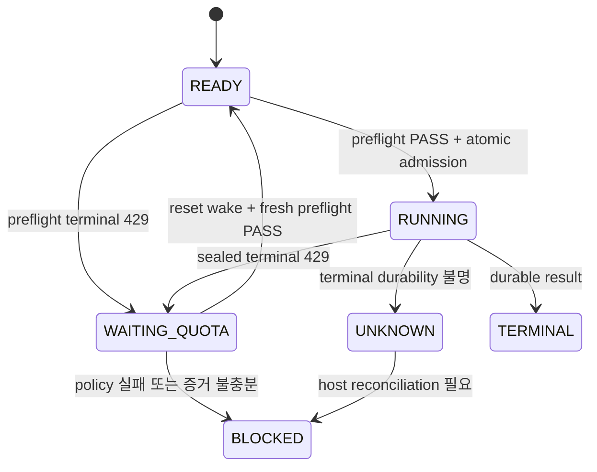

# 승인된 프로그램의 끝까지 실행 — 후속 설계 v1

상태: **채택 전 설계 후보**. [중앙 #44](https://github.com/BeautifulMind-JT/ai-ops-control-plane/pull/44)의 구현 위에 쌓는 별도 초안이다. 이 문서의 API·필드·자동 재개·외부 의존성 처리는 아직 설치되거나 구현되지 않았다. 기존 `PROGRAM_MODE.md`, `COORDINATOR_PLAYBOOK.md`, protected host ledger와 #44의 fence가 현재 실행 규칙이다. 구현 작업은 [후속 작업표](PROGRAM_EXECUTION_EVOLUTION_TASKS_KO.md)에 있다.

## 1. 목표와 현재 차이

대표님의 목표는 승인된 큰 계획을 한 번 시작하면 coordinator가 작업 분해, 구현, 비작성자 검토, 감사, 수정, 병합과 선행 작업 대기를 이어가는 것이다. 계획 밖의 결정과 실제 출시 권한을 자동 승인하는 것이 아니다. 이 후보는 다음 세 부분을 연결한다.

| 현재의 빈틈 | 제안하는 결과 |
|---|---|
| Fable의 알려진 한도 실패도 일반 ERROR로 보이고 재개를 수동 판단 | 원본 증거를 보존한 typed failure와 한 번의 reset wake. terminal 확정 및 새 preflight 성공 뒤에만 보호된 재시도 admission |
| 다른 저장소 완료는 pending 목록과 사람이 작성하는 계획 개정에 의존 | 보호된 upstream 완료 증거를 검증하고, 승인된 pending 정의를 그대로 옮기는 계획 개정 초안을 생성 |
| playbook의 issue closed/PR merged 표시와 host의 DONE 판정이 다름 | 동일한 host 상태 계산을 dependency, board, 전체 개발 완료 요약에 사용. qualification·사용자 acceptance·release를 별도 표시 |

이 PR은 실행 파일, workflow, sudoers, activation, 계정 설정과 비밀값을 변경하지 않는다. `PENDING` approval pointer를 없애지 않는다. 원래 KIX User-only 14개, chain/live-funds/public locks, ZARI 실제 화면 승인, 필름 OAuth·서비스·비용·실기기 qualification은 그대로 필요하다.

## 2. 권위와 공통 식별

모든 신규 상태는 중앙의 기존 root-owned ledger/receipt 영역에 저장하고 기존 보호된 admission을 통과한다. writer 작업 디렉터리, GitHub 댓글, 모델이 만든 JSON은 입력 자료이며 판정 권위가 아니다. 중앙 호스트가 현재 관리하지 않는 upstream은 `UNSUPPORTED_AUTHORITY`로 남긴다. 원격 서명 키·새 계정·새 토큰 권한을 이 설계에서 도입하지 않는다.

모든 mutation은 `{repository, program_id, approved_plan_commit, node_key, task_revision, writer_launch_id, operation, expected_state_version}`를 바인딩한다. audit에는 delivered PR/HEAD, gate/depth, approved scope 정의 hash, 설치 attestation까지 추가한다. read-only query도 검증한 ledger version과 plan commit을 돌려준다. caller가 verdict, receipt 경로, reset 시간, 계정, 모델, 승인 범위를 지정할 수 없다.

정규 JSON hash는 UTF-8, 객체 키 정렬, 공백 없는 JSON, 중복 키 금지, 정수형 epoch 밀리초로 계산한다. SHA는 full commit/blob SHA, 내용 digest는 소문자 64자리 SHA256이다. token·환경 전체·모델 prompt 원문을 receipt projection에 넣지 않는다. raw CLI archive는 기존 비밀 필터와 접근권한을 따른다.

## 3. 한도 실패와 안전한 재개

### 3.1 관측 사실과 판정 분리

2026-09-30 17:32 KST host 기록은 마지막 result가 `subtype=success`, `is_error=true`(bool), `api_error_status=429`였다. 바로 앞 이벤트에는 `overageStatus=rejected`, `isUsingOverage=false`가 있었고 stderr는 비어 있었다. 해당 result의 설명은 five_hour 한도, reset 2026-09-30 19:50 KST였다. seven_day reset은 2026-10-01 10:00 KST라는 안내일 뿐 weekly 소진의 증거가 아니다. 현재 wrapper의 `model run did not succeed: success`는 실패의 subtype만 노출한 오류 설명이다. `success` 문자열로 실제 실패를 성공 처리하면 안 된다.

이 기록은 회귀 fixture의 근거이며 새 preflight PASS를 대신하지 않는다. 설치 SHA256 `caeb0104f6cdc40ded634082a35bf05c95b6e0cde019ef7e55adcd25a2b9b273` 및 CLI 2.1.285에서 관측한 adapter profile로 보관한다. 다른 버전의 이벤트 형식을 추측해 수용하지 않는다.

### 3.2 실패 envelope 후보

기존 `status/result/comment_url/run` 소비자는 유지하고, 새 versioned host receipt에 다음 bounded 구조를 추가한다. 운영자의 원래 감사 JSON 보고 지시는 그대로 준수한다. 원본 출력에 새 필드를 끼워 넣어 보고하지 않는다.

```json
{
  "schema": "FABLE_FAILURE_V1",
  "error_code": "MODEL_RATE_LIMIT",
  "terminal_evidence": "VERIFIED",
  "api_error_status": 429,
  "limit_type": "five_hour",
  "reset_at_epoch_ms": 1790765400000,
  "extra_usage": {"overageStatus": "rejected", "isUsingOverage": false},
  "extra_usage_evidence_source": "preceding_event_same_run",
  "raw_result_sha256": "<64-hex>",
  "raw_event_archive_sha256": "<64-hex>",
  "adapter_profile": "claude-cli-2.1.285-observed-v1"
}
```

위 epoch는 fixture의 2026-09-30 19:50 KST(10:50 UTC)이다. 실제 구현은 검증된 CLI 자료에서 reset을 해석한다. 일자가 없는 시각, timezone 누락, 서로 충돌하는 reset, 미래 상한을 넘는 값은 자동 예약하지 않는다. bounded 정책 상한은 구현 시 승인할 설정이며 caller 입력으로 늘리지 못한다. `extra_usage`는 같은 run에서 관측한 이력이며 재시도 허가가 아니다.

| 오류 코드 | 조건 | 허용되는 처리 |
|---|---|---|
| `MODEL_RATE_LIMIT` | terminal result의 진짜 bool is_error, 429, 지원 adapter의 제한 종류·reset, 같은 run terminal archive/프로세스 종료 확인 | WAITING_QUOTA 후보; 기존 receipt를 지우지 않음 |
| `OVERAGE_UNVERIFIED` | extra usage 증거 누락·형식 불명 | 즉시 보호 중단. raw guard/process/publication 증거가 충분할 때만 운영자 TERMINAL_FAILED 정산; 자동 retry 금지 |
| `OVERAGE_NOT_BLOCKED` | extra usage가 차단되지 않았다는 명시적 증거·모순 | 즉시 보호 중단. 계정/billing 변경이나 무한 retry 금지 |
| `MODEL_EXECUTION_FAILED` | terminal 실패이나 한도 증거 부족 | BLOCKED_ERROR. 독립된 정확한 사유 보고 |
| `RESULT_INVALID` | bool 대신 문자열, malformed/중복 terminal, 잘못된 adapter schema | BLOCKED_ERROR; 모호한 실행은 UNKNOWN |
| `UNKNOWN` | timeout, 실행 생존 여부 불명, archive 유실, comment 게시 여부·성공 결과 durability가 불명 | 기존 protected fence와 host reconciliation 유지; 자동 재실행 금지 |
| `BUSY` | model lock 획득 전으로 미admit 확인 | 요청 중복 없이 다음 coordinator event에서 재확인 |

event와 result는 하나의 protected run ID에 연결되어야 한다. result에 event가 없다고 다른 run의 rejected 값을 결합하지 않는다. is_error의 문자열 truthiness로 판단하지 않는다. 성공 결과/PASS가 존재할 가능성, 남은 프로세스, comment publish 모호성이 있으면 known 429로 승격하지 않는다.

### 3.3 admission과 상태 전이

preflight가 admission **전에** 실패하면 model audit/consult request는 생성하지 않고 readiness 상태만 저장한다. audit가 이미 admit된 뒤 한도에 종료되면 기존 admission receipt의 ERROR를 보존하며 terminal 증거를 append-only settlement로 붙인다. 이 settlement가 없는 현재 #44 ERROR는 자동으로 WAITING_QUOTA가 되지 않는다.



제안하는 `quota-readiness`는 제한된 read-only 상태를 반환한다. `quota-settle`은 host가 보유한 run 증거를 재검증해 old request를 terminal-failed로 봉인한다. `quota-resume`은 봉인된 부모 ID, 현재 binding과 state version을 재검증한 뒤 **새 attempt ID**를 원자적으로 admit한다. 이름과 인자는 미래 고정 API 후보이며 현재 sudo 명령이 아니다.

재개에는 모두 필요하다: reset 도달, fresh preflight status PASS와 정확한 `extra_usage.overageStatus == rejected`, 부모 terminal 증거, 현재 plan/task/writer/HEAD/도구 binding 동일, 현재 admission/review/session 조건 충족, 글로벌 model lock, 아직 사용하지 않은 wake/settlement nonce. 각 한도 사건당 자동 wake/admission은 한 번만 허용한다. 새 시도도 한도에 실패하면 결과를 보고하고 BLOCKED로 둔다. 운영자가 승인한 별도 retry는 새로운 보호된 decision record가 필요하다.

reset timer는 root-owned one-shot durable record다. 현재 AGENTS의 event + hourly heartbeat 예외 외에 이 단발 wake를 허용하는 정책 채택이 구현 전에 필요하다. 채택 전에는 기존 heartbeat가 readiness를 재계산하며 별도 timer를 설치하지 않는다. heartbeat나 중복 webhook은 같은 record를 읽고 중복 timer/model run을 만들지 않는다. 재부팅 후 늦게 깨어나도 다시 preflight 한다. 여러 task가 함께 깨어나면 기존 단일 model lock과 공정 queue로 순차 admission하며 preflight도 lock 안에서 수행한다. 회전하는 queue의 같은 task가 뒤의 task를 굶기지 않는 fixture가 필요하다.

프로세스나 3시간 audit를 한도 timer가 취소하지 않는다. 시간은 UTC로 저장하고 KST는 표시용으로 변환한다. 계정·모델·depth·과금·extra usage 설정·도구 권한을 바꾸거나 다른 subscription으로 넘어가지 않는다. 단지 HEAD/plan을 바꿔 unresolved receipt를 우회할 수 없도록 같은 node/attempt의 ancestor unresolved 기록도 확인한다. host가 실제 새 scope와 supersession을 승인한 경우만 별도 settlement를 따른다.

## 4. 저장소 사이의 선행 완료

### 4.1 별도 dependency manifest

현재 `.aiops/program.json`은 local DAG만 이해한다. 기존 parser에 알 수 없는 필드를 몰래 넣지 않는다. 새 runtime/schema 채택 전에는 제품의 `.aiops/pending-program-nodes.json` 또는 기존 pending 문서에 원래 local 후보를 유지하고 외부 dependency 설계는 별도 문서로 둔다. `EXTERNAL_DEPENDENCY_V1` 후보 manifest는 각 pending definition과 승인된 목표 scope에 묶인다.

필수 selector는 `{repository, program_id, node_key, node_definition_sha256, allowed_approved_plan_commit, required_artifacts, required_qualification}`이다. upstream의 최신 아무 node를 선택하는 wildcard는 금지한다. downstream pending 정의 hash, intended target scope version, dependency manifest hash도 함께 저장한다. 변경된 upstream 계약은 같은 이름이어도 자동 충족하지 않는다.

### 4.2 완료 settlement tuple

root service는 직접 upstream host ledger와 GitHub merge 정보를 읽어 다음 evidence를 생성한다. caller가 제출한 값은 조회 selector일 뿐이다.

| 필드 | 검증 |
|---|---|
| `repository`, `program_id`, `node_key` | 등록된 project/profile과 canonical node |
| `approved_plan_commit`, `node_definition_sha256` | 실제 승인되고 default branch에 포함된 계획 및 immutable 정의 |
| `task_issue`, `task_revision`, `writer_launch_id` | canonical task envelope와 현재 protected host pin |
| `delivered_pr`, `delivered_head`, `merge_commit` | host-pinned exact delivered HEAD의 유효한 target 병합; PR 최신 HEAD만 검색하지 않음 |
| `protected_receipt_id`, `protected_receipt_sha256` | 해당 binding의 DONE/필수 gate 증거; audit가 필요하면 보호된 current scope receipt |
| `runtime_attestation_id` | 해당 시점의 승인/qualified runtime; unknown runtime 결과를 신뢰하지 않음 |
| `artifacts` | contract/gate/SDK/blob/digest identity. producer receipt의 exact version과 일치 |
| `qualification_state`, `qualification_evidence_ids` | selector가 요구한 서비스/실기기 qualification은 실제 증거가 있을 때만 충족 |

계약 compatibility manifest는 입력 버전 식별 자료다. 자체 PASS나 User 승인, upstream DONE, release 권한을 뜻하지 않는다. upstream artifact manifest digest를 consumer exact HEAD의 protected evidence에 연결한다. self digest나 미래 consumer HEAD를 producer digest에 넣지 않아 순환 hash를 피한다.

`issue closed`, 댓글의 DONE, schema pin commit, 열린 PR, 작성자 fake 검사, artifact가 존재한다는 사실만으로 settlement를 만들지 않는다. 적격 host ledger가 없으면 `WAITING_UPSTREAM_EVIDENCE`, qualified service가 없으면 `WAITING_QUALIFICATION`, selector가 옛 definition이면 `STALE_DEPENDENCY`다. already merged upstream의 새 writer 작업이 이전 증거를 조용히 덮어쓰지 않으며 consumer는 채택 당시 immutable tuple을 계속 사용한다.

### 4.3 pending → 승인 계획 개정

upstream settlement 이벤트에서 `dependency-propose` 후보가 CAS 방식으로 계획 개정 **초안**을 만든다. 동일 manifest/target scope version/proposal hash의 중복 이벤트는 같은 초안에 연결한다. 다음 조건을 모두 검증한다.

1. pending 정의가 이미 승인된 목표 범위에 있고 승인 시 기록한 definition hash와 동일하다.
2. selector와 upstream settlement가 exact version으로 일치한다.
3. local + external 전체 DAG가 acyclic이며 unknown/missing/self dependency가 없다.
4. 목표 default plan commit과 protected state version이 여전히 같고 downstream 이미 실행/완료된 node 정의를 덮어쓰지 않는다.
5. 현재 User-only, gate/depth, astra delegation, lock, acceptance/release 조건은 보존된다.

제안은 dependency evidence pointer, target plan diff, unchanged pending definition digest, 검증 보고를 갖는다. 현재 bootstrap/계획 변경 User 채택 규칙에 따라 검토·승인·병합·registration을 끝낸 후에만 materialize한다. 자동 초안 생성은 자동 scope 승인이나 자동 plan merge가 아니다. 목표는 승인된 pending 처리의 반복 수작업을 줄이는 것이며 첫 채택에 남아 있는 User 결정을 숨기지 않는다. 향후 정확히 제한된 plan migration 권한을 위임하려면 별도 정책/A3/사용자 결정이 필요하다.

READY/진행 중 node의 scope나 dependency가 바뀌면 기존 node를 수정해 completion 의미를 바꾸지 않는다. 새 node_key와 `supersedes` 후보 기록을 별도 계획 개정으로 승인한다. 이 필드도 schema 후보이며 현 parser에 넣지 않는다. parent revision이나 predecessor PR이 움직이면 초안을 stale로 표시하고 기존 승인 evidence를 새 commit에 재사용하지 않는다.

## 5. 같은 계산에서 나오는 완료와 진행 보고

### 5.1 상태의 네 축

`program-state` 후보 API는 현 core의 `dependency_done`/`merged_delivery`, host pins와 admission 상태를 공통 계산 함수로 추출하되 기존 helper만 호출해 새 계약을 보장한다고 주장하지 않는다. 현재 helper는 모든 scope 정의와 merge target ancestry를 확인하지 않는다. 새 wrapper가 승인 scope의 `node_definition_sha256`, host-recorded plan/task revision, writer launch, exact delivered HEAD, 승인 default target/base 및 유효한 merge ancestry를 모두 검증해야 한다. 변경된 정의에 옛 DONE을 반환하거나 다른 base로 manual merge된 PR을 완료 처리하면 실패다. 기존 완료가 그대로 유효한 경우에는 historical approved definition과 현재 정의의 동일성 및 승인된 plan ancestry를 검증해 보존한다. dependency와 query/board가 이 동일 wrapper를 사용한다.

playbook의 `issue closed OR delivery merged` 빠른 판정은 해당 API 구현·qualification 후 제거한다. issue 상태는 UI 힌트만 제공하며 dependency와 DONE의 대체 입력이 아니다. 현재 operation별 status 값은 유지한다. 새 query의 정규화 projection을 `node_state`로 제안하며 `WAITING_QUOTA`, `WAITING_UPSTREAM_EVIDENCE` 등 구체 사유는 reason/automation 상태로 분리한다.

| 축 | 값 | 의미 |
|---|---|---|
| `node_state` | NOT_STARTED / WAITING / IN_PROGRESS / DONE | 신규 query projection 후보. DONE은 host-pinned delivered HEAD의 유효한 병합을 확인한 현재 core 계산 결과. owner/admitted work가 있으면 IN_PROGRESS, dependency/policy/writer decision 등 대기면 WAITING, 나머지 미실행은 NOT_STARTED. issue closed로 대체 불가 |
| `qualification_state` | NOT_REQUIRED / UNQUALIFIED / PARTIAL / QUALIFIED | scope별 요구 항목과 실제 서비스·기기 evidence matrix. fake는 실서비스 qualification이 아님 |
| `acceptance_state` | NOT_REQUIRED / PENDING / ACCEPTED / REJECTED | 필요한 사용자 화면/성능/제품 판단. 모델·merge로 자동 ACCEPTED 금지 |
| `release_state` | NOT_AUTHORIZED / NOT_RELEASED / RELEASED | 독립 release 권한과 실행 evidence. 개발 완료나 audit PASS로 RELEASED 금지 |

qualification predicate는 approved scope의 requirement ID, 대상환경/device/provider/profile/version, evidence SHA, 검증자와 결과를 바인딩한다. `PARTIAL`은 충족/미충족 목록을 같이 반환한다. `NOT_REQUIRED`도 승인 scope의 명시적 비요구에만 쓸 수 있다. 필요한 credential/provider/hardware가 없어도 development DONE일 수 있지만 readiness가 되지 않는다. 각 제품의 최종 qualification node가 필요한 실환경을 요구한다면 그 node는 DONE으로 꾸미지 않는다.

고정 artifact 재현 qualification과 현재 접근/실행 capability는 구분한다. 후자는 `observed_at`, 대상 session/device/driver/provider 권한 version, scope에서 명시한 validity 조건·revocation evidence를 붙이고 새 admission 때 현재 유효성을 재검증한다. TTL 숫자를 모델이 발명하지 않는다. expiry/revocation/driver·session·권한 변경, 현재 상태 확인 불가이면 새 admission은 WAITING_QUALIFICATION이다. 과거 immutable DONE/artifact evidence는 지우지 않지만 옛 capability QUALIFIED를 새 환경에 전이하지 않는다. 외부 settlement selector의 required qualification도 이 현재 유효성 검증을 통과해야 한다.

### 5.2 scope 전체 집계

query는 `{scope_version, approved_plan_commit, active_total, pending_total, done_total, automation_reason_counts, qualification, acceptance, release, evidence_version}`을 반환한다. 전체 목표 분모는 active + approved pending이다. 미채택 후보 추가는 승인 scope 분모에 끼워 넣지 않고 `candidate_scope`로 별도 보여 준다. 반대로 이미 승인된 pending 19개를 숨겨 active 작업만 100%라고 보고하지 않는다.

`development_complete`는 해당 approved target scope의 모든 active와 pending 목표가 current definition으로 DONE일 때만 true다. runtime에 아직 편입되지 않은 pending은 완료가 아니다. `qualified`, `accepted`, `released`는 각 축 요구를 별도 계산한다. board는 수치, 막힌 이유, exact PR/HEAD, evidence 링크와 관측 version을 표시한다. 수정된 미래 scope는 새 scope version으로 보고하고 이전 완료 scope를 지우지 않는다.

예: 필름 mock adapter merge → 그 개발 node DONE / 실제 NVIDIA provider UNQUALIFIED / 사용자가 요구한 화질 acceptance PENDING / release NOT_AUTHORIZED. ZARI 기존 화면 capture → 기존 7개 scope의 결과로 보존하며 새 입력 UX 후보의 실제 capture acceptance에는 재사용하지 않는다. KIX User-only 14개는 coordinator가 임의로 ACCEPTED로 바꾸지 않는다.

## 6. 구현·adoption 순서와 검증

이 설계 자체, 중앙 #44 bootstrap, 각 제품의 기존 설계/등록 PR은 독립 exact-HEAD 감사와 기존 User 채택 순서를 따른다. Opus의 연속성 검토와 작성자 self-check는 Fable PASS가 아니다. 중앙 신규 실행 파일/schema/profile/runtime 변경은 별도 구현 PR과 qualified host rollout/attestation이 필요하다. 제품 후보 task가 실행될 때 `.aiops` 최종 승인 metadata와 registered scope를 다시 검증한다.

먼저 typed parser와 sealed terminal settlement를 구현하고 UNKNOWN/secret/duplicate 회귀를 통과시킨다. 다음 완료 query를 읽기 전용으로 붙여 기존 core와 board의 결과를 대조한다. 그 후 외부 dependency evidence, 전체 DAG validator와 proposal-only 경로를 붙인다. 마지막으로 no-cost 실제 host fixture에서 one-shot wake와 두 저장소 proposal을 검증하고 activation을 갱신한다. 검증되지 않은 API를 playbook 호출 목록에 넣지 않는다.

필수 검증 fixture:

| 입력/경합 | 기대 결과 |
|---|---|
| 관측 429 + subtype success + bool is_error true | typed failure, 원본 보존, PASS 아님 |
| is_error="false", 429 없이 reset 안내, 다른 run rejected, unknown adapter | 자동 quota settlement/retry 거절 |
| ERROR archive 없이 process/comment 결과 불명 | UNKNOWN fence, HEAD 바꿔 우회 불가 |
| 동일 reset 이벤트 3개 + reboot + heartbeat | 한 wake, 최대 한 retry admission, model 동시 실행 0 |
| reset 뒤 preflight 필드 누락/extra usage active | BLOCKED_POLICY, audit model 미admit |
| reset 중 plan/HEAD/task/installed hash 변경 | STALE_CONTEXT; 승인되지 않은 새 request 불가 |
| issue 닫힘 + delivered HEAD 미병합/이전 HEAD만 merge | DONE false; board/dependency 같은 결과 |
| 같은 node key지만 새 승인 scope에서 정의 변경, 또는 엉뚱한 base로 manual merge | 옛 DONE 재사용 거절; current definition/default target/ancestry를 wrapper에서 검증 |
| upstream 댓글 DONE 또는 manifest만 존재 | external dependency 불충족 |
| immutable upstream DONE이 있으나 provider 권한 회수/device 변경/qualification 만료 | 과거 완료는 보존, 현재 capability를 요구하는 새 admission은 WAITING_QUALIFICATION |
| exact protected upstream settlement + 변경 없는 approved pending | 하나의 deterministic plan proposal, dispatch 없음 |
| 두 저장소 cycle, SDK tuple mismatch, ancestor 아닌 plan | proposal 거절, 바인딩별 reason |
| active 모두 DONE + pending 미충족 | 전체 development_complete false |
| 개발 DONE + unavailable provider/screen/financial permission | qualification/acceptance/release의 실제 미충족 표시 |

## 7. 제품 설계 연결

제품 후속 PR은 이 공통 규약을 **후보**로 참조하고 현재 PENDING/실호스트 경계를 유지한다. KIX는 SDK·contract·gate·app tuple과 최종 전체 integration, 필름은 coordinator 데이터 경로와 range-verifiable pack, ZARI는 uncertainty/provenance 입력과 다음 확인 항목 UX를 구체화한다. 제품 acceptance 기준을 이 중앙 문서가 대신 승인하지 않는다. 각 PR은 부모 위의 diff만 포함하며 기존 감사 HEAD를 이동시키지 않는다.
