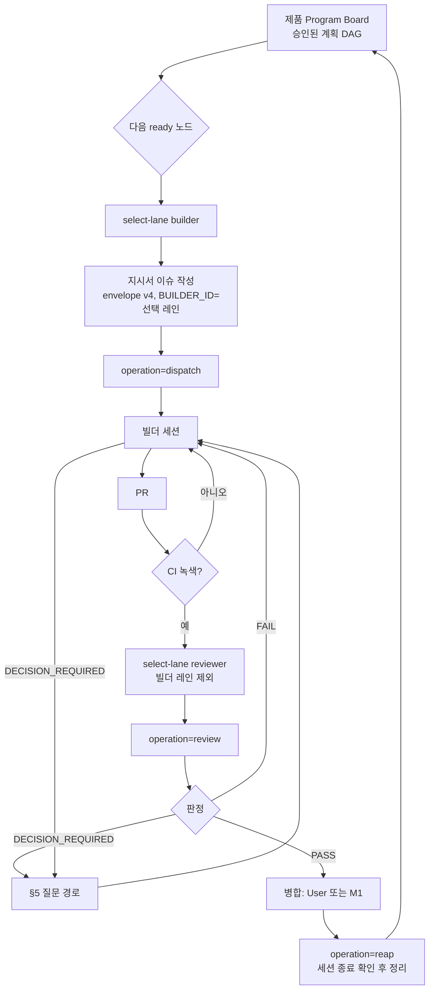

# Program mode — 설계 초안 v0

상태: **설계 초안**. 코드, 호스트, 활성화 기록은 바꾸지 않는다. 이 문서는
`RUNTIME_PATHS`에 들어 있지 않다. 구현 전에 Astra A3 설계 감사와 User 승인이
필요하다. 아래 §10의 규칙 변경은 구현 PR에서 반영하고, 그 PR도 별도로 감사한다.

목표: User가 "청사진대로 개발 시작"이라고 한 번 지시하면, 등록된 모든 제품이
승인된 계획의 끝까지 진행되게 한다. 설계 결정, 화면 승인, 출시처럼 User만 할
수 있는 결정에서만 User를 부른다.

## 0. User 결정 (2026-09-29)

세션: https://claude.ai/code/session_019aTV9AYyxrZuZfaLKTYcfm

| # | 결정 |
|---|---|
| D1 | 빌더 배정: `DEVIN → GROK_BUILD → GLM → CURSOR` 순서에서 지금 비어 있는 첫 레인 |
| D2 | 리뷰어 배정: 같은 순서에서 비어 있는 첫 레인. 그 작업의 빌더 레인은 제외 |
| D3 | 질문: Opus가 먼저 답한다. Opus가 모르면 Astra, Astra가 User를 요구하면 User |
| D4 | 작은 설계 예외는 Opus가 승인할 수 있다 (정의는 §5) |
| D5 | 현장 소장은 Claude Sonnet 5.5. 사건마다 짧은 세션으로 돈다. 끝난 작업을 자동 정리하고, 그래프와 다이어그램으로 Slack에 진행을 기록한다 |
| D6 | 레인 현황표의 형식은 구현자가 정한다 (§7) |
| D7 | 필요한 대상 저장소는 모두 등록한다 (§9) |
| D8 | 구조를 전부 만든 뒤 모든 제품을 한 번에 돌리고, 안 되는 부분을 고친다 |
| 기존 | 단일 개인 토큰 (2026-09-28, `CONTROL_PLANE_RUNTIME.md` 기록) |

**미결정 M1 (병합 위임):**
- 기본값은 현행 그대로 User만 병합한다.
- 선택안: 아래 조건을 모두 만족하면 현장 소장이 병합한다.
  - 리뷰가 PASS 또는 PASS_WITH_NOTES이고, 막는 문제가 0이다.
  - 현재 HEAD의 CI가 녹색이다.
  - A3가 아니다.
  - 충돌이 없다.

## 1. 역할

| 역할 | 담당 | 하는 일 | 하지 않는 일 |
|---|---|---|---|
| USER | 대표님 | 제품 범위, 청사진 변경, 화면 승인, 출시, 위험 감수, (M1 전까지) 병합 | — |
| ASTRA | ChatGPT Astra | 설계 권한자, A3 감사, Opus가 넘긴 질문 | 일상 리뷰 |
| OPUS | Claude Opus (고강도) | 첫 질문 응답, 작은 설계 예외 승인, 설계 초안 작성 | 제품 코드 작성, 자기가 쓴 설계의 감사 |
| COORDINATOR | Claude Sonnet 5.5 | 계획에서 다음 작업 선택, 지시서 작성, 발송, 리뷰 요청, 질문 전달, 정리, 현황 게시 | 코드 작성·리뷰, 설계 판단, 레인을 판단으로 고르기, 호스트 직접 조작 |
| BUILDER | 레인 1개 | 작업 하나를 PR까지 | 범위 밖 수정, 병합 |
| REVIEWER | 빌더와 다른 레인 1개(A2 이상은 2개) | 현재 HEAD 읽기 전용 리뷰 | 코드 수정 |
| HOST OPERATOR | 그록봇 | 설치, 자격 검증, boundary 재고정, 수동 reconcile | 지시서 작성, 리뷰, 레인 선택 |
| MECHANICAL | runtime + host helper | 검증, 레인 선택 계산, 입장 제어, 기록 | 의미 판단 |

현장 소장은 규칙표를 따르는 운전자다. 레인 선택은 기계 계층이 계산하고,
현장 소장은 그 결과를 지시서에 옮겨 적기만 한다. 애매하면 스스로 판단하지
않고 §5 질문 경로로 넘긴다.

## 2. 흐름

- 제품끼리는 동시에 진행한다.
- 한 제품 안에서는 계획 DAG가 허용한 노드만 병렬로 진행한다. 공유 파일이 겹치는 노드는 직렬로 둔다. ZARI는 `DEVIN_EXECUTION_PLAN.md` §6의 기준을 따른다.

## 3. 레인 선택 (기계 계산)

**레인 상태의 원천은 host ledger다.**
- 활성 행은 SUBMITTING, CONFIRMED, UNKNOWN 상태의 행이다.
- 레인별 활성 수는 `json_extract(packet, '$.builder_id')`로 센다. 스키마를 바꿀 필요는 없다.

**비어 있는 레인의 조건 (모두 만족):**
1. runtime `enabled_builders`, host `enabled_builders`, 레인 자격 검증 기록이 모두 켜져 있다.
2. 레인별 활성 수가 `max_active_per_lane` 미만이다. 이 값은 새 host policy 필드이고 기본값은 1이다.
3. 전체 활성 수가 `max_active_sessions` 미만이다. D8(동시 개발)에 따라 이 값은 1에서 레인 수(4)로 올린다.
4. 그 레인의 host preflight가 PASS다.

**선택 규칙**
- `select-lane --role builder|reviewer --exclude <lane>...`는 순서표에서 조건을 만족하는 첫 레인을 반환한다.
- 없으면 `NONE`을 반환하고, 현장 소장은 다음 사건 때 다시 시도한다.

**경합**
- 선택은 권고값이다. 실제 강제는 host `launch`가 레인별 상한을 원자적으로 검사할 때 일어난다.
- 두 발송이 같은 레인을 고르면, 나중 요청은 FAILED_PRESTART(`lane busy`)가 되고 자리를 차지하지 않는다.
- 이 경우 현장 소장은 `TASK_REVISION`을 올리고 새 레인으로 지시서를 고친 뒤, 새 본문 해시로 발송한다.

**불변**
- 한 작업은 CONFIRMED 이후 레인을 바꾸지 않는다. 이는 `BUILDER_LANES.md`의 "다른 레인이 진행 중인 티켓을 가져가지 않는다"를 유지하는 것이다.
- 재배정은 기존 재시도·fencing 절차만 쓴다.

## 4. 리뷰 발송

**새 workflow `operation=review`**
- packet 종류는 REVIEW다. PR URL, 리뷰 대상 HEAD SHA, 작업 지시서 포인터, 리뷰 깊이를 담는다.
- `review_request_id`를 키로 같은 host 입장 제어를 거친다. 절차는 `DISPATCH.md` §13의 NOT_STARTED→SUBMITTING→CONFIRMED/UNKNOWN을 코드로 구현한다.
- 결과는 GitHub PR 리뷰로 남는다. 판정은 PASS, PASS_WITH_NOTES, FAIL, DECISION_REQUIRED 중 하나다. 리뷰어 레인, 세션, 대상 HEAD SHA를 함께 기록한다.

**리뷰 깊이**
- A1: 리뷰어 1명.
- A2 이상: 2명. 두 번째는 빌더와 첫 리뷰어를 모두 제외한 첫 빈 레인이다.
- A3: 여기에 Astra 게이트를 더한다.

**남는 위험 (단일 토큰)**
- 리뷰어가 읽기 전용이라는 점은 지시로만 보장되고, 권한으로 강제되지 않는다.
- 보완책: 리뷰 도중 PR HEAD가 바뀌면 그 리뷰는 무효로 처리한다.

## 5. 질문 경로와 작은 설계 예외

1. 빌더나 리뷰어가 작업 이슈에 `DECISION_REQUIRED` 블록을 남긴다. 블록에는 질문, 선택지, 막힌 파일 또는 계약을 적는다.
2. 현장 소장이 Opus 상담 세션을 호출한다.
3. Opus는 `ASTRA_CONSULT_V1` 댓글로 답한다. 답은 셋 중 하나다.
   - `ANSWERED`: 답을 주고 같은 빌더가 계속한다.
   - `APPROVED_SMALL_EXCEPTION`: 작은 예외를 승인하고 근거를 남긴다.
   - `ESCALATE_ASTRA`: Astra에게 넘긴다.
4. Astra에게 넘기면 현장 소장이 Slack 결정 채널과 GitHub에 요청을 남긴다.
   - Astra는 GitHub에 답한다.
   - `USER_REQUIRED`이면 현장 소장이 이슈에 `needs-user` 라벨을 붙이고 Slack으로 User에게 알린다.
5. Opus는 그 작업의 코드를 쓰지 않는다(비작성자). 자기가 초안을 쓴 설계는 감사하지 않는다.

**작은 설계 예외**란, 승인된 청사진 안에서 아래 어느 것도 바꾸지 않고 그 작업 안에서 되돌릴 수 있는 설계 선택이다.
- 승인된 불변식
- 스키마·공개 계약
- 권한·보안 경계
- 프로토콜·금융 의미
- 저장 형식
- 제품 범위

하나라도 바꾸면 Astra로 넘긴다. AGENTS가 User 결정을 요구하는 경우에는 User에게도 간다.

## 6. 자동 정리 (reap)

**wrapper launch contract v3**
- `--session-status <session_id>`를 추가한다.
- 반환값은 `TERMINAL`, `RUNNING`, `UNKNOWN` 중 하나이고, 제공자 근거를 함께 준다. 예: Devin 세션 상태, Cursor systemd unit 상태.

**host `reap --launch-request-id <id> --evidence <URL>`**
- runner가 sudo로 호출할 수 있는 새 명령이다. 인수 형식은 status와 같이 제한한다.
- 아래가 모두 참일 때만 `RECONCILED`로 바꾼다. resolution은 `SESSION_TERMINAL_VERIFIED`다.
  - 해당 행이 CONFIRMED다.
  - 기록된 session id로 wrapper에 물었을 때 `TERMINAL`이다.
- `RUNNING`이나 `UNKNOWN`이면 거부한다. 세션을 끄지는 않는다.
- UNKNOWN 행이나 세션이 없는 경우는 지금처럼 운영자 전용 `reconcile`로 처리한다.

**언제 호출하나**
- 현장 소장은 다음 경우 `operation=reap`을 호출한다.
  - 작업 PR이 병합되거나 닫혔을 때
  - NON_CODE_EVIDENCE 작업이 합격했을 때
- evidence는 합격 기록 URL이다.

**규칙 변경**
- 대상은 `CONTROL_PLANE_RUNTIME.md`의 "운영자만 reconcile" 규칙이다.
- 이번 변경은 "wrapper가 종료를 확인한 CONFIRMED 행"에 한해 기계 정리를 추가하는 것이다.
- 시간 경과나 프로세스가 보이지 않는 것은 계속 해제 근거가 아니다.

## 7. 진행 현황 (D5, D6)

**레인 현황표**
- ai-ops-control-plane에 `AIOPS Lane Board` 이슈를 하나 둔다.
- 그 이슈에 `ASTRA_LANE_BOARD_V1` 댓글 하나를 두고, workflow가 launch, review, reap 뒤에 기계적으로 갱신한다.
- 내용은 레인별 사용 가능·자격 검증 여부, 진행 중 작업, 시작 시각, 오늘 처리 수다.
- 원천은 host의 새 읽기 전용 명령 `status --lanes`다.

**제품 진행판**
- 제품마다 Program Board 이슈를 하나 둔다.
- mermaid DAG를 두는데, GitHub가 직접 렌더링한다. 노드 색은 완료, 진행 중, 대기, 막힘을 나타낸다.
- 체크리스트와 각 노드의 작업·PR 링크를 함께 둔다.

**Slack**
- 현장 소장이 `#ai-control`에 제품별 메시지 하나를 두고 매번 갱신한다.
- 메시지에는 진행 막대, 현재 노드, 레인 현황, Program Board 링크를 넣는다.
- 다이어그램은 GitHub mermaid 링크로 준다.
- 도표 이미지는 세션 안에서 만들어 올린다. Slack 연결이 파일 업로드를 지원할 때만 해당한다.

## 8. 현장 소장 실행 방식

Claude Code Routines를 쓴다. 매 실행은 새 세션이다. 문서: https://code.claude.com/docs/en/routines.md

| Routine | 트리거 | 모델 | 용도 |
|---|---|---|---|
| R1 coordinator-pr | GitHub 트리거: 각 제품 저장소 PR opened/synchronized/closed | Sonnet 5.5 | CI 대기 → 리뷰 요청 → 병합·정리 |
| R2 coordinator-event | API 트리거 (ai-ops workflow가 finalize/review/reap 뒤 호출) | Sonnet 5.5 | 다음 노드 발송, 현황 갱신 |
| R3 coordinator-heartbeat | 매시간 | Sonnet 5.5 | 이슈 댓글·리뷰 판정·놓친 사건 수거 (GitHub 트리거가 이슈 댓글과 check run을 다루지 않음) |
| R4 opus-consult | API 트리거 (현장 소장이 호출) | Opus | §5 질문 응답 |

- **실행 규칙:** 각 실행은 `COORDINATOR_PLAYBOOK.md`(구현 PR에서 추가)의 결정표만 따른다.
  1. 해당 제품의 Program Board와 사건을 읽는다.
  2. 짧은 조치를 한 묶음만 한다.
  3. 현황을 갱신한다.
  4. 끝낸다.
- **겹침 처리:** 두 실행이 겹쳐도 안전하다.
  - 발송, 리뷰, 정리는 ai-ops workflow의 concurrency group과 control record로 멱등하다.
  - Program Board 갱신에는 버전 표식을 두고 낙관적으로 처리한다.
- **규칙 변경:** AGENTS 머리말의 "NO STANDING ROUTINES / NO POLLING"을 D5·D8 범위에서 완화한다. 사건 기반 실행을 기본으로 하고, 매시간 heartbeat만 예외로 둔다.
- **API 토큰:** Routine API 트리거는 실험 단계다(beta header). 토큰은 GitHub secret `ASTRA_COORDINATOR_ROUTINE_TOKEN`에 둔다.

## 9. 대상 저장소 (D7)

| 저장소 | 중앙 profile | host `allowed_repositories` | 조치 |
|---|---|---|---|
| kix-protocol | 있음 | 있음 | — |
| ZARI | 있음 | 있음 | — |
| film-unit-mv-studio | 있음 | 없음 | host에 추가 |
| maeum-gyeol | 있음 | 없음 | host에 추가 |
| kix-commerce-apps | 없음 | 없음 | profile, project 문서, host 추가 |
| beautiful-mind | 없음 | 없음 | **제외**: `test_unknown_target_rejected`가 거부를 요구하고, 별도 승인 규칙이 적용됨 |

- 제품마다 Program Board 계획이 필요하다. 계획은 이미 승인된 제품 문서에서만 도출한다(예: ZARI `docs/DEVIN_EXECUTION_PLAN.md`, `docs/IMPLEMENTATION_STATUS.md`).
- 문서에 없는 항목은 §5 경로로 판단을 받는다.

## 10. 구현 PR에서 반영할 규칙 변경

- `AGENTS.md`
  - 머리말: §8의 실행 방식을 반영한다.
  - §2: COORDINATOR와 OPUS 역할을 추가한다.
  - §5: 그록봇은 "개발 시작" 고정 명령만 전달한다.
  - §8: Opus의 작은 예외 승인을 추가한다.
  - §13: M1 결정을 반영한다.
  - §14: 레인 순서와 동시성을 반영한다.
- `BUILDER_LANES.md`
  - `max_active_sessions=1`을 레인별 1개, 전체 4개로 바꾼다.
  - "진행 중 티켓을 다른 레인이 가져가지 않는다"는 유지한다.
- `DISPATCH.md`: review operation과 reap 절차를 추가한다.
- `CONTROL_PLANE_RUNTIME.md`: reap, per-lane 상한, `status --lanes`를 추가한다.
- `TASK_GRAPH.md`: 기존 graph는 꺼 둔 채 유지하고, Program Board와의 관계를 적는다.

`AGENTS.md`, `DISPATCH.md`, `CONTROL_PLANE_RUNTIME.md`는 `RUNTIME_PATHS`에 들어 있다. 그래서 구현 PR이 병합되면 새 감사와 활성화 재결합(rebind)이 끝날 때까지 발송이 멈춘다. D8(전부 만든 뒤 한 번에 실행)과 맞는 순서다.

## 11. 구현 단계

| 단계 | 내용 | 담당 | 게이트 |
|---|---|---|---|
| P1 | 이 설계 | Opus 초안 | Astra A3 설계 감사, User 승인 |
| P2 | runtime/host 코드: select-lane, per-lane 상한, `status --lanes`, review, reap, wrapper v3, kix-commerce profile, §10 규칙 | Claude | 비작성자 리뷰, Astra A3, User 병합, activation rebind |
| P3 | GROK_BUILD, GLM, CURSOR 설치·자격 검증(`qualify_lane` 7개 검사). GROK_BUILD·GLM wrapper 소스는 저장소에 없으므로 P2에서 작성하거나 호스트 기존본을 소스로 가져온다 | 그록봇(호스트), Claude(소스) | lane별 증거, User 승인 |
| P4 | COORDINATOR_PLAYBOOK, Routines R1~R4, Slack·Program Board·Lane Board | Claude | 비작성자 리뷰 |
| P5 | 제품별 Program Board 계획 | 현장 소장 초안, Opus 승인 | 문서 밖 항목은 §5 |
| P6 | 전 제품 동시 실행, 실패 수정 | 전체 | D8 |

## 12. User가 직접 해야 하는 것

- claude.ai Connectors에서 Slack을 연결한다. Routines가 Slack에 게시하는 데 필요하다.
- 호스트 빌더 계정을 준비한다. Grok Build, GLM, Cursor 구독과 로그인이 필요하다.
- ChatGPT Astra가 Slack 결정 채널을 보고 GitHub에 답하도록 설정한다.
- Routine API 토큰을 GitHub secret에 등록한다.
- M1(병합 위임)을 결정한다.

## 13. 남는 위험

- **단일 토큰:** 역할 간 신원이 분리되지 않는다. 리뷰어의 읽기 전용도 강제되지 않는다(§4).
- **동시성 상향:** 동시 세션이 1개에서 4개로 늘어, 실패도 동시에 여러 건 날 수 있다. ledger, boundary, 제품별 직렬화는 그대로 유지한다.
- **Routine API:** 실험 기능이다. heartbeat가 최소 1시간이라 댓글 기반 단계는 최대 1시간 늦어질 수 있다.
- **boundary 재고정:** ai-ops main 커밋마다 필요하다. 제품 저장소의 병합에는 필요 없다. 자동화는 별도 결정으로 한다.
- **CONFIRMED 복구:** host는 CONFIRMED인데 GitHub finalize가 사라진 경우, 자동 복구가 없다(기존 Astra 노트). 현장 소장은 이 경우 멈추고 운영자에게 알린다.
