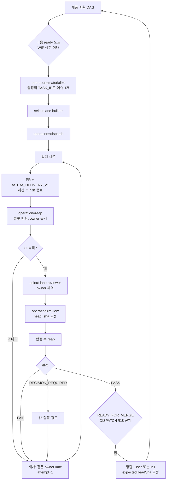

# Program mode — 설계 초안 v2

v1은 v0(`892b189`)에 대한 Astra A3 FAIL(F1~F5)을 반영했다. v2는 v1(`52ad415`) 재검토에서 남은 F4(불명 생성 요청)와 구현 확인 항목 2개를 반영하고, 호스트 조사 결과(§15)를 더했다. 대응표는 §14에 있다.

상태: **설계 초안**. 코드, 호스트, 활성화 기록은 바꾸지 않는다. 이 문서는
`RUNTIME_PATHS`에 들어 있지 않다. 구현 전에 Astra A3 설계 감사와 User 승인이
필요하다. 아래 §10의 규칙 변경은 구현 PR에서 반영하고, 그 PR도 별도로 감사한다.

목표: User가 "청사진대로 개발 시작"이라고 한 번 지시하면, 등록된 모든 제품이
승인된 계획의 끝까지 진행되게 한다. 설계 결정, 화면 승인, 출시처럼 User만 할
수 있는 결정에서만 User를 부른다.

## 0. User 결정 (2026-09-29)

세션: https://claude.ai/code/session_019aTV9AYyxrZuZfaLKTYcfm

| # | 결정 |
|---|---|
| D1 | 빌더 배정: `DEVIN → GROK_BUILD → GLM → CURSOR` 순서에서 지금 비어 있는 첫 레인 |
| D2 | 리뷰어 배정: 같은 순서에서 비어 있는 첫 레인. 그 작업의 빌더 레인은 제외 |
| D3 | 질문: Opus가 먼저 답한다. Opus가 모르면 Astra, Astra가 User를 요구하면 User |
| D4 | 작은 설계 예외는 Opus가 승인할 수 있다 (정의는 §5) |
| D5 | 현장 소장은 Claude Sonnet 5.5. 사건마다 짧은 세션으로 돈다. 끝난 작업을 자동 정리하고, 그래프와 다이어그램으로 Slack에 진행을 기록한다 |
| D6 | 레인 현황표의 형식은 구현자가 정한다 (§7) |
| D7 | 필요한 대상 저장소는 모두 등록한다 (§9) |
| D8 | 구조를 전부 만든 뒤 모든 제품을 한 번에 돌리고, 안 되는 부분을 고친다 |
| 기존 | 단일 개인 토큰 (2026-09-28, `CONTROL_PLANE_RUNTIME.md` 기록) |

**User 준비 현황 (2026-09-29):** 다음이 끝났다고 보고받았다.
- claude.ai에 Slack을 연결했다.
- Grok Build, GLM, Cursor의 구독과 로그인을 마쳤다.
- Claude에 로그인했다.

호스트의 실제 설치와 자격 검증 여부는 P3에서 따로 확인한다.

**결정 M1 (User, 2026-09-29): 병합 실행을 위임한다.** M1은 **병합을 실행하는 주체만** 바꾼다. 병합 조건은 바꾸지 않는다.
- 현장 소장이 `operation=merge`를 요청한다. 병합은 기계 계층이 계산한 결과가 참일 때만 일어난다(`control_plane_program.merge`).
  1. 기계 계층이 그 PR의 정확한 HEAD에 대해 `DISPATCH.md` §18 `READY_FOR_MERGE`를 **전부** 계산한다. 여기에는 다음이 포함된다.
     - 리뷰 깊이
     - MILESTONE·RELEASE·ARCHITECTURE Astra 게이트
     - 계약 변경 판정
     - 제품별 병합 전제조건
     - 검증 게이트
  2. 결과가 참일 때만 GitHub merge를 부른다. 이때 `expectedHeadSha`를 그 HEAD로 고정한다.
  3. 계산할 수 없는 조건이 있으면 준비 안 됨으로 본다. 예를 들어 제품 문서에 기계로 읽을 수 없는 병합 규칙이 있는 경우다. 이때는 User에게 넘긴다.
  4. 현장 소장이 판정 결과를 텍스트로 주장해서는 병합할 수 없다(§18: "computed, never accepted as arbitrary text").

**결정 M5 (User, 2026-09-30): 설계 권한과 감사(Astra)를 Claude Fable로 바꾸고, 그록봇이 실행한다.**
- Astra 역할은 그대로 두고, 맡는 모델만 ChatGPT에서 Claude Fable(`claude-fable-5-1`)로 바꾼다.
- 그록봇 컴퓨터의 고정 도구 `aiops-fable`로만 실행한다(`CONTROL_PLANE_RUNTIME.md` "Astra on the host").
  - `aiops-fable audit`: PR 하나를 정확한 HEAD에서 감사하고, 결과를 그 PR에 댓글로 남긴다.
  - `aiops-fable consult`: 질문 댓글 하나에 설계 권한자로 답한다.
- 그록봇은 요청이 적은 인자 그대로 명령을 실행하고 결과를 그대로 전한다. 판정하지 않는다.
- 설계 초안은 지금처럼 Opus가 쓴다. Fable은 설계 판단, 설계 감사, 구현 감사를 맡는다.
- 모델은 읽기 전용이다. 명령 실행, 파일 쓰기, 네트워크 도구가 없고, GitHub 토큰을 갖지 않는다. 결과 댓글은 도구가 운영자 토큰으로 올린다.
- 이전 ChatGPT Astra에 보낸 요청은 무효다. 이전 결과는 그 결과가 감사한 HEAD에 대한 기록으로만 남는다.
- 남는 위험은 §13에 적는다.

## 1. 역할

| 역할 | 담당 | 하는 일 | 하지 않는 일 |
|---|---|---|---|
| USER | 대표님 | 제품 범위, 청사진 변경, 화면 승인, 출시, 위험 감수. 병합 실행은 M1에 따라 위임했다 | — |
| ASTRA | Claude Fable (`claude-fable-5-1`, M5) | 설계 권한자, A3 감사, Opus가 넘긴 질문. 그록봇이 `aiops-fable`로 실행 | 일상 리뷰, 코드·문서 작성 |
| OPUS | Claude Opus (고강도) | 첫 질문 응답, 작은 설계 예외 승인, 설계 초안 작성 | 제품 코드 작성, 자기가 쓴 설계의 감사 |
| COORDINATOR | Claude Sonnet 5.5 | 계획에서 다음 작업 선택, 지시서 작성, 발송, 리뷰 요청, 질문 전달, 정리, 현황 게시 | 코드 작성·리뷰, 설계 판단, 레인을 판단으로 고르기, 호스트 직접 조작 |
| BUILDER | 레인 1개 | 작업 하나를 PR까지 | 범위 밖 수정, 병합 |
| REVIEWER | 빌더와 다른 레인 1개(A2 이상은 2개) | 현재 HEAD 읽기 전용 리뷰 | 코드 수정 |
| HOST OPERATOR | 그록봇 | 설치, 자격 검증, boundary 재고정, 수동 reconcile, `aiops-fable` 실행(M5) | 지시서 작성, 리뷰, 레인 선택, Astra 판정의 수정 |
| MECHANICAL | runtime + host helper | 검증, 레인 선택 계산, 입장 제어, 기록 | 의미 판단 |

현장 소장은 규칙표를 따르는 운전자다. 레인 선택은 기계 계층이 계산하고,
현장 소장은 그 결과를 지시서에 옮겨 적기만 한다. 애매하면 스스로 판단하지
않고 §5 질문 경로로 넘긴다.

## 2. 흐름

- 제품끼리는 동시에 진행한다.
- 한 제품 안에서는 계획 DAG가 허용한 노드만 병렬로 진행한다. 공유 파일이 겹치는 노드는 직렬로 둔다. ZARI는 `DEVIN_EXECUTION_PLAN.md` §6의 기준을 따른다.

## 3. 레인 선택 (기계 계산)

### 3.1 작업 소유권과 세션 점유를 분리한다 (F1)

- **작업 소유권(owner lane)**
  - 작업을 처음 CONFIRMED한 빌더 레인이다. control record의 `owner_lane`에 기록한다.
  - 작업이 끝날 때까지 바뀌지 않는다. 이는 `BUILDER_LANES.md`의 "다른 레인이 진행 중인 티켓을 가져가지 않는다"를 유지하는 것이다.
- **세션 점유(slot)**
  - host ledger의 활성 행이다(SUBMITTING, CONFIRMED, UNKNOWN).
  - 세션 종료가 확인되면 **병합과 상관없이** 반환한다(§6).
- **빌더 세션은 스스로 끝난다**
  - 빌더는 PR과 `ASTRA_DELIVERY_V1` 댓글(PR URL, HEAD SHA)을 남기면 세션을 끝낸다.
  - 전달 PR은 draft가 아닌 리뷰 준비 상태로 연다. 그래야 필수 CI가 그 HEAD에서 돈다. draft PR은 merge-check을 통과하지 못한다.
  - 막히면 `DECISION_REQUIRED`, `BLOCKED` 또는 `STALLED`를 남기고 끝낸다.
  - 세션을 끝낼 수 없거나, 끝났는지 확인할 수 없는 제공자는 program mode 레인 자격을 얻지 못한다(P3).
- **재개**
  - 재개가 필요한 경우는 CI 실패, 리뷰 FAIL, 질문에 대한 답이 온 경우다.
  - 같은 TASK_ID와 같은 owner lane으로 기존 명시적 재시도 절차를 밟는다(`expected_attempt_id = attempt_id + 1`).
  - 이전 시도가 RECONCILED(§6)여야 한다. owner lane이 비어야 시작한다. 레인은 바꾸지 않는다.

### 3.2 레인 상태와 선택

**원천은 host ledger다.** ledger v2(§4.1)의 `lane`·`role` 열로 센다.

**빈 레인의 조건 (모두 만족):**
1. runtime `enabled_builders`, host `enabled_builders`, 레인 자격 기록이 모두 켜져 있다.
2. 그 레인에 활성 행이 없다. `one_active_per_lane` 고유 인덱스가 원자적으로 강제한다(§4.1).
3. 전체 활성 수가 `max_active_sessions` 미만이다. D8에 따라 1에서 4로 올린다.
4. 그 레인의 host preflight가 PASS다.

**선택:** `select-lane --role builder|reviewer --exclude <lane>...`는 순서표에서 조건을 만족하는 첫 레인을 반환한다. 없으면 `NONE`을 반환한다.

**경합**
- 선택은 권고값이고, 강제는 host 입장 제어가 한다.
- 같은 레인을 동시에 고르면 나중 요청은 FAILED_PRESTART(`lane busy`)가 되어 자리를 잡지 않는다.
- 첫 시도(아직 CONFIRMED 없음)라면 현장 소장은 `TASK_REVISION`을 올리고 새 레인으로 지시서를 고친 뒤 다시 보낸다.
- 재개는 owner lane을 기다린다.

### 3.3 교착 방지 스케줄링 (F1)

**레인 우선순위.** 레인이 비면 그 레인에 다음 순서로 일을 준다.
1. 그 레인이 소유한 작업의 재개
2. 그 레인이 맡을 수 있는 대기 중 리뷰
3. 새 빌드

**WIP 상한.** 프로그램 전체에서 "리뷰 대기 + 수정 대기" 작업 수가 `max_active_sessions` 이상이면 새 빌드를 시작하지 않는다. 먼저 비우고 나서 채운다.

**교착이 생기지 않는 이유**
- 모든 활성 슬롯은 스스로 끝나는 세션의 것이다(3.1). 따라서 병합을 기다리며 영구히 잡혀 있는 슬롯은 없다.
- 리뷰와 재개는 새 빌드보다 먼저 슬롯을 받는다.
- 제한은 하나 남는다. 세션이 RUNNING인 채로 끝나지 않으면 그 레인만 막힌다.
  - Lane Board에 경고로 표시한다. 기준 시간은 기본 6시간이다.
  - 운영자가 처리한다. 자동으로 끄지 않는다.

## 4. 리뷰 발송

### 4.1 host 예약 구조: ledger v2 (F2)

기존 ledger는 `(repository, task)`마다 활성 행을 하나만 허용한다(`one_active_task`). 그래서 같은 작업의 리뷰 세션이 거부된다. v2는 역할별 예약으로 바꾼다.

**새 열:**
- `role`: `WRITER` 또는 `REVIEWER`
- `lane`: builder_id
- `review_key`: 리뷰어만 쓴다. `review_request_id`를 넣는다.

기존 행은 `role=WRITER`, `lane=packet.builder_id`로 채운다.

**고유 인덱스 (활성 상태 = SUBMITTING, CONFIRMED, UNKNOWN):**
- `one_active_writer ON (repository, task) WHERE role='WRITER' AND active`: 작업당 작성자 1명을 유지한다.
- `one_active_review ON (repository, task, review_key) WHERE role='REVIEWER' AND active`: 리뷰 요청당 1개다.
- `one_active_per_lane ON (lane) WHERE active`: 레인당 세션 1개다(§3.2).

**REVIEWER 입장 조건 (한 트랜잭션 안에서 검사):**
- 같은 작업에 활성 WRITER 행이 없다. HEAD가 움직이는 중에는 리뷰하지 않는다.
- `lane`이 작업의 `owner_lane`과 다르다. A2 이상에서 두 번째 리뷰어는 첫 리뷰어의 레인과도 다르다.
- packet에 리뷰 대상 `head_sha`가 고정돼 있다.

**WRITER 입장 조건 추가:**
- 같은 작업에 활성 REVIEWER 행이 없다. 리뷰 중에 수정을 시작하지 않는다.

**이전(migration)**
- 운영자 전용 `migrate --to 2`로 한다.
- 먼저 백업하고, 한 트랜잭션 안에서 열 추가, 기존 행 채우기, 인덱스 교체, `user_version=2` 설정을 한다.
- 실패하면 원래대로 되돌린다. 빈 DB를 새로 만드는 방식은 금지다.

### 4.2 review operation

- 새 workflow `operation=review`의 packet 종류는 REVIEW다. PR URL, `head_sha`, 작업 지시서 포인터, 리뷰 깊이, `owner_lane`을 담는다.
- 기록은 작업 이슈의 control record 안 `reviews[]`에 둔다. 각 항목은 `review_request_id`, `review_attempt_id`, lane, head_sha, 상태다. 상태는 `DISPATCH.md` §13의 NOT_STARTED→SUBMITTING→CONFIRMED/UNKNOWN을 따른다.
- 결과는 GitHub PR 리뷰로 남긴다. 판정은 PASS, PASS_WITH_NOTES, FAIL, DECISION_REQUIRED 중 하나다. 레인, 세션, `head_sha`를 함께 적는다.
- 리뷰어도 판정을 남기면 세션을 끝낸다. 슬롯은 §6으로 반환한다.

**리뷰 깊이**
- A1: 리뷰어 1명.
- A2 이상: 2명(4.1의 레인 조건).
- A3와 명시 게이트(MILESTONE, RELEASE): Astra 게이트를 더한다.

**남는 위험 (단일 토큰)**
- 리뷰어가 읽기 전용이라는 점은 지시로만 보장된다.
- 보완책은 세 가지다.
  - 리뷰 시작 시점과 판정 시점의 PR HEAD가 다르면 그 리뷰는 무효다.
  - 판정은 `head_sha`에 묶인다.
  - 리뷰 세션 동안 같은 작업의 WRITER 입장은 막힌다.

**판정 결속: 세션 서명과 host 고정 (P2 구현, 재검토 반영)**
- 모든 레인이 같은 GitHub 계정으로 글을 쓴다. 그래서 GitHub에 있는 글(이슈 본문, control record 댓글, 리뷰 본문)은 어느 레인이든 고칠 수 있다. **gate 판단은 이 글을 근거로 쓰지 않는다.**
- 근거는 세 가지뿐이다.
  - host ledger(레인 UID는 쓸 수 없다)
  - host가 기록한 `plan_commit`의 plan
  - 살아 있는 PR 상태
- control record는 사람과 현장 소장이 보는 투영(projection)이다.
- **세션 서명**
  - 발송할 때마다 비밀 키(32 hex)를 새로 만든다. 작성자 packet에는 `delivery_nonce`, 리뷰어 packet에는 `review_nonce`로 들어간다.
  - packet은 mode 0600이다. 키는 그 세션의 레인 UID와 host ledger만 읽는다.
  - adapter는 세션 디렉터리(0700) 안에 서명 도구 `signer.py`(0600)를 둔다. 모델은 이 도구를 실행해 나온 한 줄을 그대로 올린다.
  - 판정 줄: `ASTRA_REVIEW_V1 review=<id> head=<sha> verdict=<...> depth=<A1|A2> required=<A1|A2|A3> contract_change=<NO|YES> mac=<HMAC-SHA256>`
    - `depth`는 `VERIFIED_REVIEW_DEPTH`(실제로 리뷰한 깊이)다. `required`는 `VERIFIED_REQUIRED_DEPTH`(실제 diff가 요구하는 최소 깊이, `DISPATCH.md` §13)다.
    - merge-check과 리뷰 발송은 `EFFECTIVE_AUDIT_FLOOR = max(plan의 AUDIT_FLOOR, 고정된 모든 required)`를 쓴다. 이 값이 필요한 리뷰 수, 요구 깊이, 두 번째 슬롯 여부를 정한다. A3이면 Astra `ARCHITECTURE` 게이트가 붙는다.
  - 전달 줄: `ASTRA_DELIVERY_V1 pr=<n> head=<sha> mac=<HMAC-SHA256>`
  - 차단 줄(작성자와 리뷰어 모두): `ASTRA_BLOCKED_V1 kind=<DECISION_REQUIRED|BLOCKED|STALLED> launch=<launch id> mac=<HMAC-SHA256>`
  - **서명되지 않은 글은 어떤 세션도 해제하지 못한다.** host는 키가 있는 세션을 서명된 줄 없이 해제하지 않는다. 그래서 다른 레인이 `BLOCKED` 글을 올리거나 진짜 판정 줄을 고쳐도, 판정을 버리고 리뷰를 다시 뽑게 만들 수 없다.
  - 키는 공개되지 않는다. 그래서 다른 레인은 이 줄을 만들거나 고칠 수 없다. 작성자도 리뷰 판정을 만들 수 없고, 다른 작업의 전달 줄을 옮겨 써도 검증되지 않는다.
- **host 고정 (write-once)**
  - host `reap`이 저장된 packet의 키로 MAC을 검증한다.
  - 리뷰 판정은 그 세션의 review id와 head를 가리켜야 한다.
  - 검증된 내용은 해제 기록에 한 번만 고정된다. 다시 부를 때는 같은 evidence와 같은 줄이어야 한다. 다르면 거부한다.
- **review id**
  - 저장소, 작업, 전달한 작성자 시도의 host launch id, head, 슬롯으로 정한다.
- **merge-check이 세는 것**
  - host `task-status`의 리뷰어 행 중, 이번 전달의 review id로 고정된 판정만 센다.
  - 판정을 낸 레인은 서로 달라야 하고, 그 작업의 작성자 레인(host 기록)이 아니어야 한다.
  - PR에 올라온 글이나 control record의 `reviews[]`는 세지 않는다.
- **판정 없이 끝난 리뷰어**
  - 판정 없이 끝난 리뷰어는 자기 서명 도구로 만든 차단 줄을 evidence로 reap한다. 운영자가 reconcile할 수도 있다. 그다음 같은 슬롯을 attempt+1로 다시 발송한다.
  - 다시 발송은 슬롯과 head마다 세션 3번까지다(`MAX_REVIEW_SESSIONS`). 그 뒤는 `REVIEW_RETRIES_EXHAUSTED`로 운영자가 본다.
  - 리뷰어의 차단 줄은 BLOCKED와 STALLED만 된다. 리뷰어가 사람의 결정이 필요하다고 보면 판정 `DECISION_REQUIRED`로 남긴다. 그 판정은 merge-check을 막고 질문 경로로 간다. 서명 도구와 host 모두 리뷰어의 `DECISION_REQUIRED` 차단 줄을 거부한다. 그래서 질문이 "판정 없음"으로 바뀌어 다시 뽑히지 않는다.
  - **운영자 주의(가려진 판정):** 리뷰어 세션이 끝났는데 reap할 서명 줄이 없으면, reconcile 전에 두 가지를 확인한다.
    - 그 리뷰의 수정 기록(GraphQL `userContentEdits`)
    - 세션 디렉터리의 `output.log`
    - 같은 계정의 다른 레인이 진짜 판정 줄을 지웠을 수 있다. 판정이 FAIL이었으면 reconcile하지 말고 작성자 재개(REVIEW_FEEDBACK)로 처리한다.
    - 강화안: host가 레인 세션 디렉터리에서 서명 줄을 직접 수집한다(`--collect`).
  - 새 attempt의 launch id가 host에 이미 있으면(예: 운영자의 never-admitted 기록) 그 id를 건너뛴다.

## 5. 질문 경로와 작은 설계 예외

1. 빌더나 리뷰어가 작업 이슈에 `DECISION_REQUIRED` 블록을 남긴다. 블록에는 질문, 선택지, 막힌 파일 또는 계약을 적는다.
2. 현장 소장이 Opus 상담 세션을 호출한다.
3. Opus는 `ASTRA_CONSULT_V1` 댓글로 답한다. 답은 셋 중 하나다.
   - `ANSWERED`: 답을 주고 같은 빌더가 계속한다.
   - `APPROVED_SMALL_EXCEPTION`: 작은 예외를 승인하고 근거를 남긴다.
   - `ESCALATE_ASTRA`: Astra에게 넘긴다.
4. Astra에게 넘기면 현장 소장이 이슈에 `consult-astra` 라벨을 붙이고, Slack 결정 채널에 한 줄을 남긴다.
   - 그 줄: `ASTRA_CONSULT_REQUEST repo=<저장소> issue=<번호> comment=<질문 댓글 id>`
   - 운영자(그록봇)가 그 값 그대로 `aiops-fable consult`를 실행한다(M5). 도구가 `ASTRA_CONSULT_V1 result=<ANSWERED|USER_REQUIRED> by=ASTRA_FABLE` 답을 이슈에 올린다.
   - 운영자에게 이 줄을 전달하는 것은 지금은 User나 Slack이다. 현장 소장이 runtime으로 직접 부르는 방식은 program mode를 다시 켤 때 따로 정한다.
   - `USER_REQUIRED`이면 현장 소장이 이슈에 `needs-user` 라벨을 붙이고 Slack으로 User에게 알린다.
5. Opus는 그 작업의 코드를 쓰지 않는다(비작성자). 자기가 초안을 쓴 설계는 감사하지 않는다.

**작은 설계 예외**란, 승인된 청사진 안에서 아래 어느 것도 바꾸지 않고 그 작업 안에서 되돌릴 수 있는 설계 선택이다.
- 승인된 불변식
- 스키마·공개 계약
- 권한·보안 경계
- 프로토콜·금융 의미
- 저장 형식
- 제품 범위

하나라도 바꾸면 Astra로 넘긴다. AGENTS가 User 결정을 요구하는 경우에는 User에게도 간다.

## 6. 자동 정리 (reap)

**종료 증거: 레인 UID 정지 확인 (P2 구현, v2 설계 노트 반영)**

v2의 wrapper `--session-status` 안은 **폐기했다.** P3 조사 결과, 세 adapter 모두 세션 상태(`.sessions/<request>/status.json`)를 빌더 UID로 **빌더가 쓸 수 있는 작업 트리 안에** 기록한다. 그래서 빌더가 위조할 수 있다(Astra v2 노트 "빌더가 위조할 수 없는 종료 증거" 불충족).

대신 host helper가 **해당 레인 builder UID의 live process가 0개**인지를 직접 확인한다.
- **경합 없는 점검 (구현 A3 1차 지적 2 반영).** 바깥에서 `/proc`를 한 번 훑는 것만으로는 부족하다. 부모가 자식을 만들고 끝나는 사이에 둘 다 놓칠 수 있다. 그래서 레인 wrapper의 `--quiescence` 모드로 레인 계정 안에서 점검한다.
  1. 레인 계정이 `kill(-1, SIGSTOP)`으로 자기 UID의 모든 프로세스를 멈춘다.
  2. 이 신호는 fork와 경합하지 않는다. kill(-1)은 자식을 붙일 때 필요한 task list 잠금 아래에서 순회하고, 멈춤 신호가 걸린 fork는 커널이 중단시킨다.
  3. 그래서 SIGCONT 전까지 프로세스 집합은 줄어들기만 한다. 이때 목록을 만들고, 풀어 준다.
  - 바깥 스캔도 보조 증인으로 함께 쓴다. 둘 중 하나라도 프로세스를 보면 해제하지 않는다. 점검이 실패해도 해제하지 않는다.
  - root로는 이 점검을 실행하지 않는다.
- **prestart 실패의 확인 (구현 A3 1차 지적 1 반영).** adapter의 결과 파일은 빌더 UID가 쓸 수 있다. 그래서 실행 중인 빌더가 `FAILED_PRESTART`를 적고 계속 돌 수 있다.
  - host는 adapter가 `FAILED_PRESTART`를 보고해도, 레인이 비었음을 위 점검으로 직접 확인한 뒤에만(최대 10초 대기) 슬롯을 돌려준다.
  - 확인하지 못하면 `UNKNOWN`으로 기록하고 슬롯을 유지한다.
- 제어 identity가 `/proc`에서 real, effective, saved, fs UID를 검사한다. `/proc`에 hidepid가 있으면 거부한다.
- 레인당 세션이 1개(§4.1)이므로 "UID에 프로세스 없음"이면 그 세션의 supervisor와 CLI가 모두 끝났다는 뜻이다.
- 빌더가 몰래 띄운 백그라운드 프로세스도 프로세스로 보인다. 그래서 그 레인은 해제되지 않는다.
- 빌더는 자기 프로세스를 `/proc`에서 숨길 수 없다. 자식 PID 네임스페이스도 부모에서 보인다.

**레인 위생 (P3 호스트 설치 중 발견, 2026-09-30)**
- 레인 계정에는 세션 밖 프로세스가 하나도 없어야 한다. 하나라도 있으면 그 레인의 세션은 해제되지 않는다(위 정지 확인). 이것은 의도한 동작이다. 안전한 쪽으로 멈춘다.
- 설치 점검에서 네 레인 모두 잔여물이 나왔다. 원장에 진행 작업은 없었고, 레인 계정에 키링도 없었다.
  - 대화형 로그인 때 연 브라우저(Grok, Cursor)
  - GLM을 OpenCode로 고정하기 전의 ZCode 시험
  - CLI가 실행될 때마다 저절로 뜬 세션 dbus
- **dbus 자동 실행 차단.** adapter와 supervisor는 모든 레인 CLI를 `DBUS_SESSION_BUS_ADDRESS=disabled:`로 실행한다. 주소가 설정돼 있으면 libdbus와 GDBus는 버스를 자동으로 띄우지 않는다. 레인에는 키링이 없으므로 잃는 기능이 없다.
- **census 직렬화 (구현 A3 재감사 참고 1).** host는 레인마다 원장 디렉터리의 `census-<LANE>.lock`을 잡고 census를 한 번에 하나만 돌린다. 두 census가 서로를 멈춘 채 남는 일을 막는다.
- **운영자 정리.** 대화형 로그인이나 수동 시험 뒤에는 운영자가 레인을 정리한다. 원장에 그 레인의 진행 작업이 없는 경우에만 하고, root로는 하지 않는다. 절차는 `CONTROL_PLANE_RUNTIME.md`의 "레인 정리"에 있다.
- **User 결정 (2026-09-30): 자동 청소는 넣지 않는다. 운영자(그록봇)가 손으로 정리한다.**
  - 세션이 띄운 프로세스(예: 에이전트가 켜 둔 개발 서버)가 세션 뒤에 남으면, 그 레인은 해제되지 않는다.
  - 현장 소장은 스스로 정리하지 않는다. `reap`이 같은 세션에서 두 번 연속 "live process"로 거부되면 운영자에게 정리를 요청한다(`COORDINATOR_PLAYBOOK.md` §3 행 1a).
  - 운영자는 그 세션의 supervisor가 끝났음을 확인한 뒤에만 정리한다. 절차는 `CONTROL_PLANE_RUNTIME.md`의 "레인 정리"에 있다.

adapter의 `status.json`은 참고용이다.

**산출물 고정 (P2 구현)**
- 작성자 reap의 evidence는 이 작업 이슈의 댓글 URL이어야 한다.
  - 그 댓글은 이번 시도의 host 예약 시각 이후에 쓰여야 한다(`status`의 `reserved_at`).
  - 서명된 전달 줄은 정확히 하나여야 한다.
- 전달 줄이면 host가 검증한 뒤 PR 번호와 head를 고정한다(§4.2). 리뷰와 merge-check은 이 host 고정값만 쓴다.
- **PR 하나는 작업 하나의 전달물이다.** 이것을 두 겹으로 막는다. 막지 않으면 그 PR의 실제 작성자가 두 번째 작업의 "비작성자" 리뷰어가 될 수 있다.
  - 전달 PR은 그 작업의 브랜치 `astra/<task id 소문자>`에서 와야 한다. PR의 head 브랜치는 만든 뒤 바꿀 수 없으므로, 다른 작업의 PR은 이 조건을 통과할 수 없다.
  - 다른 작업이 이미 고정한 PR은 host가 거부한다.
- program mode의 노드는 PR로만 끝난다(`deliverable_mode: PR`). PR이 아닌 산출물은 서명·고정할 방법이 없어서 plan 검증에서 거부한다.
- 고정 뒤 PR head가 바뀌면 리뷰를 발송하지 않는다. 작성자가 다시 전달해야 한다.
- 새 시도는 이전 시도의 전달과 리뷰를 이어받지 않는다.
- 작업 소유 레인(owner lane)은 host 기록의 첫 작성자 세션 레인이다. control record의 값은 쓰지 않는다.
- **revision 결속 (구현 A3 1차 지적 3 반영).** host 행은 packet의 `task_revision`을 보여 준다.
  - 리뷰 발송과 merge-check은 현재 작성자 시도의 revision이 host 기록 `plan_commit`과 그 레인으로 만든 현재 revision과 같을 때만 전달과 리뷰를 인정한다.
  - `start`가 plan을 올린 뒤 발송이 실패해도, 예전 전달과 리뷰로 새 요구사항이 준비됨이 되지 않는다.
- **병합된 작업 (지적 7).** 고정된 전달 PR이 전달된 head 그대로 병합됐으면 `start`는 `DONE`을 돌려주고 다시 발송하지 않는다.
- **A0 (지적 4).** program mode에는 A0 자격 확인 경로가 없다(`DISPATCH.md` §16). 그래서 plan의 A0는 A1로 올린다.
- **필수 체크 (지적 5).** 제품 profile은 `program_merge_policy: STANDARD`와 함께 `program_required_checks`(필수 check run 이름 목록)를 선언한다.
  - merge-check은 목록의 각 체크가 head에서 success인지 확인한다. 선언이 없으면 준비 안 됨이다.
  - 관측된 체크가 진행 중이거나 실패여도 준비 안 됨이다.
- reap이 어느 작업의 세션을 해제하는지는 이슈의 task key와 host materialization으로 정한다. control record의 `task_id`는 쓰지 않는다.
- 이슈 본문은 host 기록과 plan으로 정해진다. 본문이 바뀌어 있으면 `operation=review`가 원래 envelope로 되돌린다. merge-check은 읽기만 하고, 본문이 다르면 준비 안 됨으로 보고한다. 메모는 본문이 아니라 댓글로 남긴다.
- `start`는 plan commit을 envelope를 다시 쓰기 직전에만 올린다. 작업이 바쁘거나 빈 레인이 없어서 멈춘 `start`는 plan을 바꾸지 않는다.
- 기록이 `SUBMITTING`이나 `UNKNOWN`이어도 host가 그 요청을 `FAILED_PRESTART`나 `RECONCILED`로 막아 둔 상태라면, `start`는 새 attempt로 재개한다.
- **의존 노드**
  - `start`와 merge-check은 `depends_on` 노드가 DONE인지 기계적으로 확인한다.
  - DONE은 그 노드에 고정된 전달 PR이 전달된 head 그대로 병합된 경우다. PR이 없는 노드는 이슈가 completed로 닫힌 경우다.

**host `reap --launch-request-id <id> --evidence <URL> [--pin-stdin]`** (서명 줄은 stdin의 `{"pin": "<line>"}`)
- runner가 sudo로 호출할 수 있는 새 명령이다. 인수 형식은 status와 같이 제한한다.
- 아래가 모두 참일 때만 `RECONCILED`로 바꾼다. resolution은 `SESSION_TERMINAL_VERIFIED`다.
  - 해당 행이 CONFIRMED다. WRITER와 REVIEWER 모두 해당한다.
  - 그 행의 레인 builder UID에 live process가 없다(위 정지 확인).
- `RUNNING`이나 `UNKNOWN`이면 거부한다. 세션을 끄지는 않는다.
- UNKNOWN 행이나 세션이 없는 경우는 지금처럼 운영자 전용 `reconcile`로 처리한다.

**언제 호출하나 (F1: 병합과 분리)**
- 현장 소장은 세션이 산출물을 남긴 직후 `operation=reap`을 호출한다. PR 병합이나 종료를 기다리지 않는다. 산출물은 다음 중 하나다.
  - `ASTRA_DELIVERY_V1`
  - 리뷰 판정
  - `DECISION_REQUIRED`
  - `BLOCKED` 또는 `STALLED`
  - NON_CODE_EVIDENCE 증거
- evidence는 그 산출물의 URL이다.
- 산출물이 있는데 wrapper가 `RUNNING`이라고 답하면, 다음 실행에서 다시 확인한다.
- reap은 작업 소유권을 바꾸지 않는다. owner lane은 control record에 그대로 남는다.
- **control record에 결과를 반영한다.**
  - reap이 성공하면 해당 시도의 `launch_state`를 새 상태 `RELEASED`로 바꾼다. 리뷰 항목이면 `reviews[].state`를 바꾼다.
  - 지금 코드는 CONFIRMED 기록에서 재시도를 거부한다. 재개(§3.1)는 **host가 `RECONCILED/SESSION_TERMINAL_VERIFIED`이고 기록이 `RELEASED`인 경우에만** 허용한다.
  - 재개할 때 BUILDER_ID는 owner lane과 같아야 한다.
  - CONFIRMED 상태의 재시도 거부는 그대로 유지한다.
- **reap은 멱등이고, GitHub 반영 실패는 같은 결과로 복구한다** (v1 재검토의 구현 확인 항목 1).
  - 이미 `RECONCILED/SESSION_TERMINAL_VERIFIED`인 요청에 다시 `reap`을 부르면 저장된 결과를 그대로 돌려준다. wrapper를 다시 묻지 않고, 새 판정도 만들지 않는다.
  - host reap은 성공했는데 GitHub에 `RELEASED`를 쓰지 못한 경우를 생각한다. 이때 기록은 `CONFIRMED`로 남는다.
    - 다음 실행(§8.1)이 host `status`로 이 상태를 보고 같은 요청으로 `reap`을 다시 부른다.
    - 돌아온 저장 결과로 `RELEASED`를 다시 쓴다. 새 해제나 새 판정은 만들지 않는다.
  - 재개 입장도 먼저 host 상태를 본다. host가 `SESSION_TERMINAL_VERIFIED`인데 기록이 `CONFIRMED`면, 반영을 먼저 복구한 뒤 재시도 절차로 들어간다.

**규칙 변경**
- 대상은 `CONTROL_PLANE_RUNTIME.md`의 "운영자만 reconcile" 규칙이다.
- 이번 변경은 "wrapper가 종료를 확인한 CONFIRMED 행"에 한해 기계 정리를 추가하는 것이다.
- 시간 경과나 프로세스가 보이지 않는 것은 계속 해제 근거가 아니다.

## 7. 진행 현황 (D5, D6)

**레인 현황표**
- ai-ops-control-plane에 `AIOPS Lane Board` 이슈를 하나 둔다.
- 그 이슈에 `ASTRA_LANE_BOARD_V1` 댓글 하나를 두고, workflow가 launch, review, reap 뒤에 기계적으로 갱신한다.
- 내용은 레인별 사용 가능·자격 검증 여부, 진행 중 작업, 시작 시각, 오늘 처리 수다.
- 원천은 host의 새 읽기 전용 명령 `status --lanes`다.

**제품 진행판**
- 제품마다 Program Board 이슈를 하나 둔다.
- mermaid DAG를 두는데, GitHub가 직접 렌더링한다. 노드 색은 완료, 진행 중, 대기, 막힘을 나타낸다.
- 체크리스트와 각 노드의 작업·PR 링크를 함께 둔다.

**Slack**
- 현장 소장이 `#ai-control`에 제품별 메시지 하나를 두고 매번 갱신한다.
- 메시지에는 진행 막대, 현재 노드, 레인 현황, Program Board 링크를 넣는다.
- 다이어그램은 GitHub mermaid 링크로 준다.
- 도표 이미지는 세션 안에서 만들어 올린다. Slack 연결이 파일 업로드를 지원할 때만 해당한다.

## 8. 현장 소장 실행 방식

Claude Code Routines를 쓴다. 매 실행은 새 세션이다. 문서: https://code.claude.com/docs/en/routines.md

| Routine | 트리거 | 모델 | 용도 |
|---|---|---|---|
| R1 coordinator-pr | GitHub 트리거: 각 제품 저장소 PR opened/synchronized/closed | Sonnet 5.5 | CI 대기 → 리뷰 요청 → 병합·정리 |
| R2 coordinator-event | API 트리거 (ai-ops workflow가 finalize/review/reap 뒤 호출) | Sonnet 5.5 | 다음 노드 발송, 현황 갱신 |
| R3 coordinator-heartbeat | 매시간 | Sonnet 5.5 | 이슈 댓글·리뷰 판정·놓친 사건 수거 (GitHub 트리거가 이슈 댓글과 check run을 다루지 않음) |
| R4 opus-consult | API 트리거 (현장 소장이 호출) | Opus | §5 질문 응답 |

### 8.1 실행 규칙 (F5: 상태 기반)

각 실행은 `COORDINATOR_PLAYBOOK.md`(구현 PR에서 추가)의 결정표만 따른다.

**상태 기반(level-triggered)으로 동작한다.** 사건은 실행을 깨우는 신호일 뿐이다.
1. 매 실행은 어떤 사건으로 깨어났든 다음을 GitHub 진실에서 **다시 계산**한다.
   - 해당 프로그램의 계획
   - control record
   - PR과 리뷰 상태
   - Lane Board
2. 그 계산에서 나온 짧은 조치 한 묶음만 한다.
3. 현황을 갱신한다.
4. 끝낸다.

**사건이 사라져도 상태가 어긋나지 않는다.** 사건 유실, 실행 거절, 실행 한도 초과는 진행을 늦출 뿐이다. 다음 실행이 같은 상태에서 이어받는다.

**지연 보장은 없다.** v0의 "최대 1시간 지연" 문구는 철회한다.
- Routines는 실행 한도에 따라 사건을 버리거나 실행을 거절할 수 있다.
- heartbeat(R3)는 "결국 한 번은 실행된다"를 위한 장치다. 시간을 보장하지 않는다.

**멈춤 감지**
- 모든 실행은 Lane Board에 `last_coordinator_run`(시각, routine, 결과)을 남긴다.
- 3시간 넘게 갱신이 없으면 Lane Board와 Slack 메시지에 `STALE`을 표시한다.
- 한도 때문에 실행이 막혀 있으면 진행도 멈춘다. 이는 안전한 정지다. 반쪽짜리 상태 변경은 남지 않는다(8.2, 8.3).
- 선택 사항으로 hosted 감시 workflow를 둘 수 있다. 시간당 1분, 월 약 $4.3이다. 별도 결정한다.

### 8.2 작업 생성의 원자성 (F4)

현장 소장은 작업 이슈를 **직접 만들지 않는다.**

**새 workflow `operation=materialize`가 계획 노드를 작업으로 만든다.** 이 workflow는 기계 코드다.
- 입력은 `program`, `plan_version`, `node_id`다.
- `concurrency: materialize-<program>`로 한 프로그램 안의 생성을 직렬화한다.
- **결정적 작업 키**
  - `TASK_ID = <PROGRAM>-<NODE_ID>`다.
  - 이슈 본문에 `ASTRA_TASK_KEY_V1 program=
 plan=<v> node=<n>` 표식을 넣는다.
  - 표식이 있는 이슈에는 라벨 `aiops-task`를 붙인다.
**생성 요청 기록 (v2, F4 재검토 반영)**

생성 요청 자체에도 발송과 같은 불명 상태 규율을 적용한다.

**host ledger의 새 테이블 `materializations`**
- 기본 키: `(program, node)`
- 열: `request_id`(결정적, `sha256(program, node, attempt)`), `attempt`, `plan_commit`, `state`, `issue_number`, `updated`
- `state`는 `SUBMITTING`, `CREATED`, `UNKNOWN`, `ABANDONED` 중 하나다.
- 원자성은 host SQLite 트랜잭션과 기존 exclusive in-flight 잠금으로 보장한다. GitHub 조회는 원자성 근거가 아니다.

**절차.** runner가 sudo로 부르는 새 host 명령 `materialize-begin`과 `materialize-finish`를 쓴다.

1. `materialize-begin program node plan_commit`
   - 행이 없으면 `SUBMITTING`으로 넣고 `CREATE_ALLOWED`와 `request_id`를 돌려준다. 이 기록은 GitHub 요청보다 먼저 영속화된다.
   - `CREATED`면 이슈 번호를 돌려준다. 생성하지 않는다.
   - `SUBMITTING`이나 `UNKNOWN`이면 `UNRESOLVED`를 돌려준다. 생성하지 않는다.
2. `CREATE_ALLOWED`일 때만 이슈를 한 번 만든다.
   - 본문에 `ASTRA_TASK_KEY_V1 program=
 node=<n> request=<request_id>`를 넣는다.
   - 성공 응답을 받으면 `materialize-finish CREATED <issue>`를 호출한다.
   - 오류, timeout, 응답 유실이면 `materialize-finish UNKNOWN`을 호출한다. finish 호출 자체가 실패해 `SUBMITTING`으로 남아도 `UNKNOWN`과 똑같이 다룬다.
3. `UNRESOLVED`일 때는 라벨 `aiops-task`의 이슈를 열린 것과 닫힌 것 모두 REST 목록으로 끝까지 읽는다.
   - 같은 `request_id`의 이슈가 있으면 `CREATED`로 확정한다.
   - 없어도 **다시 만들지 않는다.** "목록에 없음"은 미생성의 증거가 아니다. 처리 중인 요청이 나중에 완료될 수 있기 때문이다.
   - 상태는 `UNKNOWN`으로 유지한다. Lane Board에 `MATERIALIZE_UNKNOWN`으로 표시하고, 그 노드는 진행하지 않는다.
4. **UNKNOWN에서 벗어나는 방법은 두 가지뿐이다.**
   - 이후 조회에서 같은 `request_id`의 이슈를 찾으면 `CREATED`가 된다.
   - 운영자 전용 `materialize-resolve --not-created --evidence <URL>`를 쓴다. 이 경우 해당 `request_id`를 `ABANDONED`로 봉인하고 `attempt+1`로 새 요청을 허용한다.
   - 봉인된 요청의 이슈가 나중에 나타나면 정본이 아니다. `DUPLICATE_TASK` 규칙으로 닫는다. 한 요청 ID는 한 번만 생성을 허락받는다.
5. **중복이 보이면 멈춘다.** 같은 `(program, node)` 표식을 가진 열린 이슈가 둘 이상이면 발송하지 않고 `DUPLICATE_TASK`로 멈춘다.
   - 정본은 ledger에 `CREATED`로 기록된 이슈다.
   - 나머지를 닫는 것은 운영자 확인 뒤에 한다.

**계획 버전 변경:** 노드 내용이 바뀌면 같은 이슈의 `TASK_REVISION`을 올린다. 새 이슈를 만들지 않는다. 절차는 §8.3을 따른다.

**한 작업이 두 번 발송되지 않는다.** 설령 이슈가 둘 생겨도 막힌다.
- host `one_active_writer`는 `(repository, task)` 단위다.
- TASK_ID가 같으면 동시에 두 작성자가 생길 수 없다.

### 8.3 계획 버전과 작업 revision 직렬화 (v1 재검토의 구현 확인 항목 2)

**계획의 원천은 제품 저장소의 `.aiops/program.json`이다.**
- 제품 저장소 PR로만 바뀐다. 비작성자 리뷰를 거친다.
- 계획을 제품 저장소에 두기 때문에 ai-ops main이 바뀌지 않는다. 그래서 boundary 재고정이 필요 없다.
- `plan_commit`은 그 파일이 들어 있는 제품 main 커밋이다.

**오래된 계획은 최신을 덮어쓰지 못한다.**
- `materializations.plan_commit`과 작업의 현재 `plan_commit`을 host에 기록한다.
- 새 `plan_commit`은 기록된 커밋의 **후손**일 때만 받는다. runner의 제품 checkout에서 `git merge-base --is-ancestor`로 확인한다.
- 같은 커밋이면 아무것도 하지 않는다. 조상이거나 관계없는 커밋이면 `STALE_PLAN`으로 거부한다.

**작업 revision 변경은 발송, 리뷰, 병합과 같은 직렬화를 따른다.**
- 노드 내용 변경이나 레인 경합 뒤의 BUILDER_ID 교체는 `operation=revise`로만 한다.
- `revise`는 해당 작업 이슈의 concurrency group을 쓴다. 이 group은 발송, 리뷰, 병합, reap과 같은 `astra-control-<repo>-<target>-<issue>`다.
- host 작업 잠금 아래에서, 같은 작업에 활성 WRITER나 REVIEWER 행이 없을 때만 본문을 바꾼다.
- 바꾼 뒤에는 새 본문 해시와 새 `TASK_REVISION`이 되므로 기존 리뷰와 게이트 결과는 무효다(AGENTS §9).
- CONFIRMED 이후에는 BUILDER_ID를 바꾸는 revise를 거부한다(§3.1 owner lane 불변).

### 8.4 기타

- **겹침:** 발송, 리뷰, 정리, 병합, 생성은 모두 ai-ops workflow의 concurrency group과 control record·ledger로 멱등하다. Program Board는 표시일 뿐이고 원천이 아니다.
- **규칙 변경:** AGENTS 머리말의 "NO STANDING ROUTINES / NO POLLING"을 D5·D8 범위에서 완화한다. 사건 기반 실행을 기본으로 하고, 매시간 heartbeat만 예외로 둔다.
- **API 토큰:** Routine API 트리거는 실험 단계다(beta header). 토큰은 GitHub secret `ASTRA_COORDINATOR_ROUTINE_TOKEN`에 둔다.

## 9. 대상 저장소 (D7)

| 저장소 | 중앙 profile | host `allowed_repositories` | 조치 |
|---|---|---|---|
| kix-protocol | 있음 | 있음 | — |
| ZARI | 있음 | 있음 | — |
| film-unit-mv-studio | 있음 | 없음 | host에 추가 |
| maeum-gyeol | 있음 | 없음 | host에 추가 |
| kix-commerce-apps | 없음 | 없음 | profile, project 문서, host 추가 |
| beautiful-mind | 없음 | 없음 | **제외**: `test_unknown_target_rejected`가 거부를 요구하고, 별도 승인 규칙이 적용됨 |

- 제품마다 Program Board 계획이 필요하다. 계획은 이미 승인된 제품 문서에서만 도출한다(예: ZARI `docs/DEVIN_EXECUTION_PLAN.md`, `docs/IMPLEMENTATION_STATUS.md`).
- 문서에 없는 항목은 §5 경로로 판단을 받는다.

## 10. 구현 PR에서 반영할 규칙 변경

- `AGENTS.md`
  - 머리말: §8의 실행 방식을 반영한다.
  - §2: COORDINATOR와 OPUS 역할을 추가한다.
  - §5: 그록봇은 "개발 시작" 고정 명령만 전달한다.
  - §8: Opus의 작은 예외 승인을 추가한다.
  - §13: M1 결정을 반영한다.
  - §14: 레인 순서와 동시성을 반영한다.
- `BUILDER_LANES.md`
  - `max_active_sessions=1`을 레인별 1개, 전체 4개로 바꾼다.
  - "진행 중 티켓을 다른 레인이 가져가지 않는다"는 유지한다.
- `DISPATCH.md`
  - 추가한다: review operation, reap 절차, materialize 절차, owner lane과 재개 절차, 교착 방지 스케줄링.
  - §18 `READY_FOR_MERGE`는 **바꾸지 않는다.** M1은 실행 주체만 바꾼다.
- `CONTROL_PLANE_RUNTIME.md`: 추가한다.
  - reap
  - ledger v2와 `migrate --to 2`
  - 레인 고유 인덱스
  - `status --lanes`
  - REVIEWER·WRITER 입장 조건
- `TASK_GRAPH.md`: 기존 graph는 꺼 둔 채 유지하고, Program Board와의 관계를 적는다.

`AGENTS.md`, `DISPATCH.md`, `CONTROL_PLANE_RUNTIME.md`는 `RUNTIME_PATHS`에 들어 있다. 그래서 구현 PR이 병합되면 새 감사와 활성화 재결합(rebind)이 끝날 때까지 발송이 멈춘다. D8(전부 만든 뒤 한 번에 실행)과 맞는 순서다.

## 11. 구현 단계

| 단계 | 내용 | 담당 | 게이트 |
|---|---|---|---|
| P1 | 이 설계 | Opus 초안 | Astra A3 설계 감사, User 승인 |
| P2 | runtime/host 코드: ledger v2와 migrate, 레인·역할 입장 조건, select-lane, `status --lanes`, materialize, review, reap, merge(READY_FOR_MERGE 계산), wrapper v3, kix-commerce profile, §10 규칙. F1~F4 재현 테스트 포함 | Claude | 비작성자 리뷰, Astra A3, User 병합, activation rebind |
| P3 | ① 호스트 adapter 3종 원본을 저장소로 가져와 감사한다(§15) ② 레인별 `--session-status` 원천을 확정한다 ③ GROK_BUILD 빌더 계정 인증을 고친다 ④ GLM(M2), CURSOR(M3) 결정을 받는다 ⑤ 레인별 `qualify_lane` 7개 검사를 통과한다 | 그록봇(호스트), Claude(소스) | lane별 증거, User 승인 |
| P4 | COORDINATOR_PLAYBOOK, Routines R1~R4, Slack·Program Board·Lane Board | Claude | 비작성자 리뷰 |
| P5 | 제품별 Program Board 계획 | 현장 소장 초안, Opus 승인 | 문서 밖 항목은 §5 |
| P6 | 전 제품 동시 실행, 실패 수정 | 전체 | D8 |

## 12. User가 직접 해야 하는 것

- ~~claude.ai Connectors에서 Slack 연결~~ 완료 (2026-09-29 보고).
- ~~Grok Build, GLM, Cursor 구독과 로그인~~ 완료 (2026-09-29 보고). 호스트의 빌더 Unix 계정에 로그인됐는지는 P3에서 확인한다.
- ~~ChatGPT Astra가 Slack 결정 채널을 보고 GitHub에 답하도록 설정한다.~~ M5로 대체했다. 대신 그록봇 컴퓨터의 감사 계정에 Claude 로그인을 한 번 한다(그록봇이 로그인 주소를 전달한다).
- Routine API 토큰을 GitHub secret에 등록한다.
- ~~M1(병합 위임)~~ 결정: 위임 (2026-09-29).
- ~~M2(GLM 하네스)~~ 결정: OpenCode + Z.AI Coding Plan 승인 (2026-09-29).
- ~~M4(레인 토큰 권한)~~ 결정: **레인별 계정을 두지 않는다** (2026-09-29, "심플하게"). 단일 토큰의 남는 위험(§13)을 User가 감수한다. 별도 UID 서명 helper도 만들지 않는다.

## 13. 남는 위험

- **단일 토큰:** 역할 간 GitHub 신원이 분리되지 않는다. 리뷰어의 읽기 전용도 강제되지 않는다(§4).
  - gate 판단은 이 위험에서 분리했다(§4.2). 서명 키는 세션 레인 UID와 host만 읽는다. merge-check은 host 고정값, plan, 살아 있는 PR만 본다. 그래서 GitHub 글을 고쳐도 READY_FOR_MERGE는 바뀌지 않는다.
  - **남는 것:** 병합할 수 있는 토큰을 가진 레인은 계산된 gate를 거치지 않고 PR을 직접 병합하거나 기본 브랜치에 push할 수 있다. 이것은 control plane이 막을 수 없다. 막으려면 둘 중 하나가 필요하다(`AGENTS.md` §11).
    - 레인별 GitHub 신원을 쓰되 병합과 관리자 권한을 주지 않는다.
    - 레인 토큰이 우회할 수 없는 branch protection을 건다.
  - **User가 감수한다 (M4 결정, 2026-09-29: 레인별 계정을 두지 않는다).** 레인이 계산된 gate를 거치지 않고 직접 병합하거나 push하는 것은 control plane이 막지 못한다. 계산된 gate는 control plane 자신의 병합(`operation=merge`)과 준비 판정에만 적용된다.
  - 같은 이유로 필수 체크 확인은 CI가 만든 check run을 전제한다. 레인 토큰으로 가짜 `success` check run을 만들 수 있으면, 이 확인은 증거가 되지 못한다. 이 위험도 같은 결정으로 감수한다.
- **prestart 재시도:** `FAILED_PRESTART`(예: 45초 안에 끝나지 않는 CURSOR clone)는 다음 실행에서 다시 시도된다. 이 재시도에는 별도 상한이 없고, host `max_launches_per_24h`만 막는다. program mode에서는 이 값을 정해 둔다(P3).
- **CURSOR:** M3 결정에 따라 systemd 없는 adapter(`adapters/cursor/`)로 바꿨다. 이 adapter는 v2 packet을 stdin으로 받고, 서명 도구를 쓰며, 모든 프로세스가 helper의 launch 아래에 있다. 그래서 program mode 순서의 마지막 레인으로 선택된다. 호스트 설치와 자격 검증(P3) 전에는 host `enabled_builders`와 preflight가 막는다.
- **세션 키는 그 세션의 모델이 읽을 수 있다:** 서명 도구 파일은 그 레인 UID 소유(0600)다. 그래서 리뷰 대상 PR 안의 prompt injection이 리뷰어 모델에게 키를 출력하게 만들 수 있다. 키가 새면 그 세션의 판정을 위조할 수 있다.
  - 막는 방법은 키를 레인이 읽을 수 없는 별도 UID의 서명 helper에 두는 것이다. M4 결정(단순하게)에 따라 이것은 하지 않고, 위험을 감수한다. 키는 세션마다 새로 만들므로, 샌 키는 그 한 세션의 판정에만 쓸 수 있다.
- **레인 UID 정지 확인의 전제:** 동결 점검(§6)은 fork 경합을 닫는다. 그래도 아래 세 가지를 전제한다.
  - helper의 PID namespace가 `/proc`의 namespace와 같다(`NSpid` 1단계).
  - 레인 UID에 subuid/subgid 범위가 없다.
  - 레인 프로세스는 helper의 launch에서 시작된다.
  - 앞의 두 가지는 reap마다 확인하고, 맞지 않으면 거부한다. 세 번째는 supervisor 가져오기(P3)에서 확인한다.
  - subuid/subgid는 `/etc/subuid`와 `/etc/subgid`만 읽는다. NSS나 libsubid로 범위를 주는 호스트라면 그 설정이 없음을 P3에서 확인한다.
  - 레인 UID로 cron, at 같은 예약 실행이 없어야 한다(P3 확인). helper의 트리 밖에서 시작된 프로세스라도 helper와 같은 namespace라면 보이지만, 레인이 예약을 걸 수 없어야 운영 전제가 성립한다.
- **동시성 상향:** 동시 세션이 1개에서 4개로 늘어, 실패도 동시에 여러 건 날 수 있다. ledger, boundary, 제품별 직렬화는 그대로 유지한다.
- **Routine API와 실행 한도:** API는 실험 기능이다. 사건 유실이나 실행 거절이 생길 수 있어 지연을 보장하지 않는다(§8.1). 상태 기반 실행과 STALE 표시로 안전하게 멈추게 한다.
- **스스로 끝나지 않는 세션:** 그 레인만 막힌다(§3.3). 운영자가 처리한다.
- **ledger v2 이전:** 운영자가 백업한 뒤 한 트랜잭션으로 수행한다. 실패하면 되돌린다.
- **boundary 재고정:** ai-ops main 커밋마다 필요하다. 제품 저장소의 병합에는 필요 없다. 자동화는 별도 결정으로 한다.
- **CONFIRMED 복구:** host는 CONFIRMED인데 GitHub finalize가 사라진 경우, 자동 복구가 없다(기존 Astra 노트). 현장 소장은 이 경우 멈추고 운영자에게 알린다.
- **Astra = Claude Fable (M5):** User가 감수한다(2026-09-30).
  - **같은 회사의 모델:** 설계 초안과 감사 도구의 지시문은 Opus가 쓰고, 감사는 Fable이 한다. 둘 다 Claude다. 독립성은 세션, 모델, 고정 지시문으로만 나뉜다.
  - **감사 댓글도 단일 토큰으로 올라간다(M4):** 같은 토큰으로 가짜 `ASTRA_AUDIT_V1` 댓글을 만들 수 있다. gate는 이 글을 읽지 않는다. 강한 증거는 host 실행 폴더의 원본 출력이고, 댓글에 그 sha256이 있다.
  - **PR 내용의 prompt injection:** 감사 대상 안의 글이 판정을 흔들 수 있다. 읽기 전용, 네트워크 없음, 자격 증명 없음, 고정 지시문, 조작 시도는 BLOCKING으로 보고하게 한 것이 대책이다.
  - **도구 변경:** `aiops-fable`을 바꾸면 그 변경도 감사받는다. 도구 파일은 `RUNTIME_PATHS`에 있어서 활성화 재결합이 필요하다.
  - **대체 모델 없음:** Fable을 쓸 수 없으면 감사는 기다린다. 다른 모델로 바꾸지 않는다(`AGENTS.md` §12). 거절 시 자동 전환도 끄고, 결과에 다른 모델이 섞이면 올리지 않는다.
  - **추가 과금:** 도구는 Claude가 "초과 사용 막힘"이라고 알릴 때만 실행을 이어 간다. 계정의 추가 사용량(usage credits)과 자동 충전은 User가 claude.ai 설정에서 끈다. 이것이 꺼져 있어야 현장 소장 Routine을 설정한다.

## 14. v0 A3 감사(FAIL) 대응

v0 감사 대상 HEAD는 `892b189e39b961f9c82ffb129219d1a361c5a9ec`이다.

| # | 지적 | 대응 | 위치 |
|---|---|---|---|
| F1 (P1) | 빌더 CONFIRMED 슬롯이 병합까지 남아, 네 레인이 모두 차면 리뷰 단계에서 교착된다 | 작업 소유권(owner lane)과 세션 점유(slot)를 분리했다. 산출물을 남긴 세션은 스스로 끝나고, 확인되면 병합 전에 reap한다. 재개는 같은 owner lane의 명시적 재시도로 한다. 재개와 리뷰를 새 빌드보다 먼저 하고, WIP 상한을 둔다 | §3.1, §3.3, §6 |
| F2 (P1) | `(repository, task)` 단일 활성 행 때문에 같은 작업의 리뷰가 거부된다 | ledger v2를 도입했다(`role`, `lane`, `review_key`). 작성자 고유성, 리뷰 요청 고유성, 레인 고유성을 각각 인덱스로 둔다. REVIEWER 입장은 활성 WRITER가 없고 owner lane이 아닐 때만 허용하고, 그 반대도 막는다. 이전은 운영자가 백업 후 한 트랜잭션으로 한다 | §4.1 |
| F3 (P1) | M1 병합 조건이 필수 승인을 빠뜨린다 | M1은 실행 주체만 위임한다. `DISPATCH.md` §18 `READY_FOR_MERGE` 전체를 기계적으로 계산한다. 여기에는 마일스톤·출시 게이트와 제품별 병합 전제조건이 포함된다. 병합은 `expectedHeadSha`로 고정한다. 계산할 수 없는 조건은 준비 안 됨으로 본다 | §0 M1 |
| F4 (P2) | 겹친 현장 소장 실행이 같은 노드로 작업 이슈를 중복 생성한다 | 현장 소장은 이슈를 직접 만들지 않는다. `operation=materialize`가 프로그램 단위로 직렬화한다. 결정적 TASK_ID와 `ASTRA_TASK_KEY_V1` 표식을 쓰고, REST 목록 조회로 선점을 확인한 뒤 만든다. 응답이 유실되면 같은 이슈로 복구한다. 중복이 보이면 `DUPLICATE_TASK`로 멈춘다 | §8.2 |
| F5 (노트) | "최대 1시간 지연"은 보장할 수 없고 사건이 유실될 수 있다 | 문구를 철회했다. 상태 기반 실행으로 유실을 무해하게 만들고, `last_coordinator_run`과 STALE 표시로 멈춤을 감지한다 | §8.1 |
| F4 재검토 (P2, v1 `52ad415`) | 생성 요청이 처리 중일 때 목록 조회만으로 다시 만들면 중복될 수 있다 | host `materializations` 테이블에 `SUBMITTING`을 먼저 영속화한다. 결과가 불명이면 `UNKNOWN`으로 두고, "목록에 없음"만으로는 다시 만들지 않는다. UNKNOWN은 같은 `request_id`의 이슈를 찾거나 운영자가 `materialize-resolve --not-created`로 확인해야 벗어난다. 봉인된 요청은 다시 쓰지 않는다 | §8.2 |
| 구현 확인 1 | reap은 성공했는데 `RELEASED` 반영이 실패한 경우 | reap을 멱등으로 해서 저장 결과를 다시 쓰고 반영을 복구한다. 재개 입장에서 host 상태를 먼저 본다 | §6 |
| 구현 확인 2 | 오래된 `plan_version`이 덮어쓰는 경우, revision 직렬화 | 계획은 제품 저장소 파일로 두고, 새 커밋이 후손일 때만 받는다(`STALE_PLAN`). `operation=revise`는 작업 concurrency group과 host 작업 잠금을 쓰고, 활성 세션이 없을 때만 바꾼다 | §8.3 |

유지한 방향(감사에서 타당하다고 본 것):
- 레인 선택은 기계적으로 계산한다.
- Opus의 작은 예외 권한은 제한한다.
- UNKNOWN은 운영자에게 남긴다.

v1도 문서뿐이다. F1~F4의 재현 테스트는 P2 구현 PR에 포함하고, 그 PR에서 검증한다.

## 15. 호스트 조사 결과 (2026-09-29, 읽기 전용, 그록봇 보고)

| 레인 | wrapper | adapter / CLI | preflight | 막힌 점 |
|---|---|---|---|---|
| DEVIN | `/opt/astra/bin/astra-builder-devin` (bash, `2fea887b…`) | `astra-devin-adapter`, Devin CLI `3000.11.1`, 빌더 계정 로그인됨 | **PASS** (`PERSISTENT_SUPERVISOR`) | — |
| GROK_BUILD | `astra-builder-grok-build` (bash, `0da78f98…`) | `astra-grok-adapter`, Grok CLI `1.0.40` | **FAIL**: `grok CLI auth check failed` | 빌더 계정 `astra-builder-grokbuild`(uid 995)에서 인증이 안 된다. User 로그인이 다른 계정에 되어 있을 가능성이 있다 |
| GLM | `astra-builder-glm` (bash, `c3451744…`) | `astra-glm-adapter`, OpenCode `1.18.32`, Z.AI Coding Plan | adapter 직접 실행 PASS. host에서는 `not enabled` | host `enabled_builders`에 없다. OpenCode 하네스는 **M2로 명시 승인됐다(2026-09-29)** |
| CURSOR | **없음** | Cursor CLI `2026.09.23-86fc751`. box 사용자로만 로그인됨 | `not enabled` | 빌더 계정이 없고 wrapper가 설치되지 않았다. **저장소의 Cursor adapter(`control_plane_cursor.py`)는 systemd user manager가 필요한데 이 호스트에는 systemd가 없다(PID 1 = tini)** |

**host policy 현재값**
- `enabled_builders=[DEVIN, GROK_BUILD]`
- `builder_uids`: DEVIN 996, GROK_BUILD 995, GLM 994
- `max_active_sessions=1`
- `wrapper_paths`에는 CURSOR 항목이 없다.

**설계에 미치는 영향**
1. **adapter 원본이 저장소에 없다.** 세 adapter는 호스트에만 있다(`/opt/astra/libexec/astra-*-adapter`).
   - wrapper v3의 `--session-status`와 program mode 레인 자격은 **감사된 원본**이 전제다.
   - 따라서 P3의 첫 단계는 adapter 원본을 저장소로 가져와 감사하는 것이다. 비밀값이 없는지 확인한 뒤 원본과 sha256을 가져온다.
2. **세션 종료 증거 (P3 조사 결과 반영)**
   - 세 adapter 모두 `.sessions/<launch_request_id>/status.json`에 상태를 기록한다. 종료 상태는 `EXITED`, `KILLED`, `SPAWN_FAILED`, `SUPERVISOR_ERROR`다.
   - 세션 ID는 `devin-cli:`, `grok-cli:`, `opencode-cli:` 형식이다.
   - 이 파일은 빌더 UID 소유의 작업 트리 안에 있어 위조할 수 있다. 그래서 reap은 **레인 UID 정지 확인**을 쓴다(§6).
   - P3에서 확인할 것:
     - 쉬는 레인 UID에 상주 프로세스가 0개인지. CLI가 남기는 백그라운드 데몬이 있으면 레인이 해제되지 않는다.
     - `/proc`에 hidepid가 없는지.
   - `devin -r`은 대화를 재개하므로 증거 확인에 쓰지 않는다.
3. **CURSOR는 이 호스트에서 지금 방식으로 켤 수 없다.** 선택지는 셋이다.
   - (a) systemd가 있는 별도 호스트
   - (b) systemd가 없는 supervisor로 adapter를 바꾸기. 이는 custodian과 fence 설계를 바꾸는 일이라 A2 이상 리뷰가 필요하다. **(User 선택, 아래 M3 결정)**
   - (c) 보류
   - 결정 전까지는 비활성이다. 순서표는 비활성 레인을 건너뛴다.
4. **Slack**
   - 현장 소장은 claude.ai의 Slack 연결을 쓴다(User 연결 완료).
   - 호스트 flow gateway(`127.0.0.1:8787`, 6cc78d4 설치본)의 봇 토큰은 쓰지 않는다. gateway는 그대로 둔다.
5. **첫 동시 실행의 실제 레인 수**
   - P3이 끝나기 전에는 DEVIN 1개다.
   - GROK_BUILD 로그인을 고치고 M2를 승인하면 3개가 된다.
   - Cursor 결정까지 끝나면 4개가 된다.
   - `max_active_sessions`는 켜진 레인 수에 맞춘다.

**결정 M2 (User, 2026-09-29): 승인.** GLM 레인의 하네스는 **OpenCode `1.18.32` + Z.AI Coding Plan**이다. 호스트 `enabled_builders`에 GLM을 넣는 일은 P3에서 한다.

**결정 M3 (User, 2026-09-29): (b).** 이 호스트에서 systemd 없이 돌리는 adapter로 바꾼다. 구현은 `adapters/cursor/`다. 구조는 다른 세 레인과 같다: wrapper, adapter, 분리된 supervisor. 끝난 supervisor는 tini가 정리한다. 이전의 systemd 방식 `control_plane_cursor.py`는 폐기했다.
